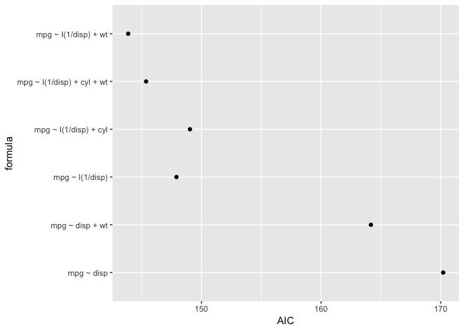
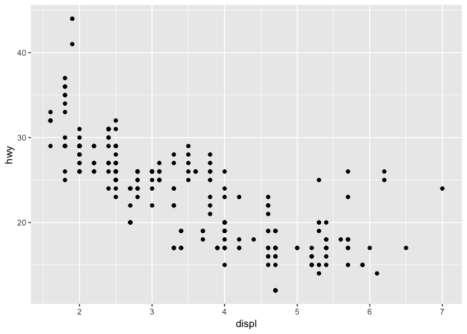
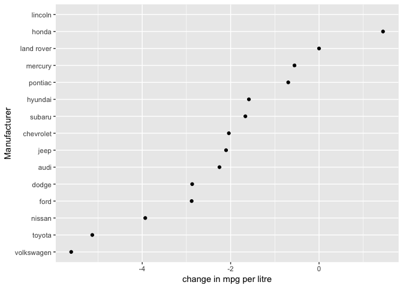

Advanced R 09-functionals examples
================
ian handel
2019-04-17

``` r
# ignore errors when knitting
knitr::opts_chunk$set(error = TRUE)

library(tidyverse)
```

    ## ── Attaching packages ──────────────────────────────────────────── tidyverse 1.2.1 ──

    ## ✔ ggplot2 3.1.1       ✔ purrr   0.3.2  
    ## ✔ tibble  2.1.1       ✔ dplyr   0.8.0.1
    ## ✔ tidyr   0.8.3       ✔ stringr 1.4.0  
    ## ✔ readr   1.3.1       ✔ forcats 0.4.0

    ## ── Conflicts ─────────────────────────────────────────────── tidyverse_conflicts() ──
    ## ✖ dplyr::filter() masks stats::filter()
    ## ✖ dplyr::lag()    masks stats::lag()

``` r
# for purrr, dplyr, ggplot2

library(repurrrsive)
# for data
```

================================================== Exercises as\_mapper

``` r
?as_mapper

got_chars
```

    ## [[1]]
    ## [[1]]$url
    ## [1] "https://www.anapioficeandfire.com/api/characters/1022"
    ## 
    ## [[1]]$id
    ## [1] 1022
    ## 
    ## [[1]]$name
    ## [1] "Theon Greyjoy"
    ## 
    ## [[1]]$gender
    ## [1] "Male"
    ## 
    ## [[1]]$culture
    ## [1] "Ironborn"
    ## 
    ## [[1]]$born
    ## [1] "In 278 AC or 279 AC, at Pyke"
    ## 
    ## [[1]]$died
    ## [1] ""
    ## 
    ## [[1]]$alive
    ## [1] TRUE
    ## 
    ## [[1]]$titles
    ## [1] "Prince of Winterfell"                                
    ## [2] "Captain of Sea Bitch"                                
    ## [3] "Lord of the Iron Islands (by law of the green lands)"
    ## 
    ## [[1]]$aliases
    ## [1] "Prince of Fools" "Theon Turncloak" "Reek"            "Theon Kinslayer"
    ## 
    ## [[1]]$father
    ## [1] ""
    ## 
    ## [[1]]$mother
    ## [1] ""
    ## 
    ## [[1]]$spouse
    ## [1] ""
    ## 
    ## [[1]]$allegiances
    ## [1] "House Greyjoy of Pyke"
    ## 
    ## [[1]]$books
    ## [1] "A Game of Thrones" "A Storm of Swords" "A Feast for Crows"
    ## 
    ## [[1]]$povBooks
    ## [1] "A Clash of Kings"     "A Dance with Dragons"
    ## 
    ## [[1]]$tvSeries
    ## [1] "Season 1" "Season 2" "Season 3" "Season 4" "Season 5" "Season 6"
    ## 
    ## [[1]]$playedBy
    ## [1] "Alfie Allen"
    ## 
    ## 
    ## [[2]]
    ## [[2]]$url
    ## [1] "https://www.anapioficeandfire.com/api/characters/1052"
    ## 
    ## [[2]]$id
    ## [1] 1052
    ## 
    ## [[2]]$name
    ## [1] "Tyrion Lannister"
    ## 
    ## [[2]]$gender
    ## [1] "Male"
    ## 
    ## [[2]]$culture
    ## [1] ""
    ## 
    ## [[2]]$born
    ## [1] "In 273 AC, at Casterly Rock"
    ## 
    ## [[2]]$died
    ## [1] ""
    ## 
    ## [[2]]$alive
    ## [1] TRUE
    ## 
    ## [[2]]$titles
    ## [1] "Acting Hand of the King (former)" "Master of Coin (former)"         
    ## 
    ## [[2]]$aliases
    ##  [1] "The Imp"            "Halfman"            "The boyman"        
    ##  [4] "Giant of Lannister" "Lord Tywin's Doom"  "Lord Tywin's Bane" 
    ##  [7] "Yollo"              "Hugor Hill"         "No-Nose"           
    ## [10] "Freak"              "Dwarf"             
    ## 
    ## [[2]]$father
    ## [1] ""
    ## 
    ## [[2]]$mother
    ## [1] ""
    ## 
    ## [[2]]$spouse
    ## [1] "https://www.anapioficeandfire.com/api/characters/2044"
    ## 
    ## [[2]]$allegiances
    ## [1] "House Lannister of Casterly Rock"
    ## 
    ## [[2]]$books
    ## [1] "A Feast for Crows"         "The World of Ice and Fire"
    ## 
    ## [[2]]$povBooks
    ## [1] "A Game of Thrones"    "A Clash of Kings"     "A Storm of Swords"   
    ## [4] "A Dance with Dragons"
    ## 
    ## [[2]]$tvSeries
    ## [1] "Season 1" "Season 2" "Season 3" "Season 4" "Season 5" "Season 6"
    ## 
    ## [[2]]$playedBy
    ## [1] "Peter Dinklage"
    ## 
    ## 
    ## [[3]]
    ## [[3]]$url
    ## [1] "https://www.anapioficeandfire.com/api/characters/1074"
    ## 
    ## [[3]]$id
    ## [1] 1074
    ## 
    ## [[3]]$name
    ## [1] "Victarion Greyjoy"
    ## 
    ## [[3]]$gender
    ## [1] "Male"
    ## 
    ## [[3]]$culture
    ## [1] "Ironborn"
    ## 
    ## [[3]]$born
    ## [1] "In 268 AC or before, at Pyke"
    ## 
    ## [[3]]$died
    ## [1] ""
    ## 
    ## [[3]]$alive
    ## [1] TRUE
    ## 
    ## [[3]]$titles
    ## [1] "Lord Captain of the Iron Fleet" "Master of the Iron Victory"    
    ## 
    ## [[3]]$aliases
    ## [1] "The Iron Captain"
    ## 
    ## [[3]]$father
    ## [1] ""
    ## 
    ## [[3]]$mother
    ## [1] ""
    ## 
    ## [[3]]$spouse
    ## [1] ""
    ## 
    ## [[3]]$allegiances
    ## [1] "House Greyjoy of Pyke"
    ## 
    ## [[3]]$books
    ## [1] "A Game of Thrones" "A Clash of Kings"  "A Storm of Swords"
    ## 
    ## [[3]]$povBooks
    ## [1] "A Feast for Crows"    "A Dance with Dragons"
    ## 
    ## [[3]]$tvSeries
    ## [1] ""
    ## 
    ## [[3]]$playedBy
    ## [1] ""
    ## 
    ## 
    ## [[4]]
    ## [[4]]$url
    ## [1] "https://www.anapioficeandfire.com/api/characters/1109"
    ## 
    ## [[4]]$id
    ## [1] 1109
    ## 
    ## [[4]]$name
    ## [1] "Will"
    ## 
    ## [[4]]$gender
    ## [1] "Male"
    ## 
    ## [[4]]$culture
    ## [1] ""
    ## 
    ## [[4]]$born
    ## [1] ""
    ## 
    ## [[4]]$died
    ## [1] "In 297 AC, at Haunted Forest"
    ## 
    ## [[4]]$alive
    ## [1] FALSE
    ## 
    ## [[4]]$titles
    ## [1] ""
    ## 
    ## [[4]]$aliases
    ## [1] ""
    ## 
    ## [[4]]$father
    ## [1] ""
    ## 
    ## [[4]]$mother
    ## [1] ""
    ## 
    ## [[4]]$spouse
    ## [1] ""
    ## 
    ## [[4]]$allegiances
    ## list()
    ## 
    ## [[4]]$books
    ## [1] "A Clash of Kings"
    ## 
    ## [[4]]$povBooks
    ## [1] "A Game of Thrones"
    ## 
    ## [[4]]$tvSeries
    ## [1] ""
    ## 
    ## [[4]]$playedBy
    ## [1] "Bronson Webb"
    ## 
    ## 
    ## [[5]]
    ## [[5]]$url
    ## [1] "https://www.anapioficeandfire.com/api/characters/1166"
    ## 
    ## [[5]]$id
    ## [1] 1166
    ## 
    ## [[5]]$name
    ## [1] "Areo Hotah"
    ## 
    ## [[5]]$gender
    ## [1] "Male"
    ## 
    ## [[5]]$culture
    ## [1] "Norvoshi"
    ## 
    ## [[5]]$born
    ## [1] "In 257 AC or before, at Norvos"
    ## 
    ## [[5]]$died
    ## [1] ""
    ## 
    ## [[5]]$alive
    ## [1] TRUE
    ## 
    ## [[5]]$titles
    ## [1] "Captain of the Guard at Sunspear"
    ## 
    ## [[5]]$aliases
    ## [1] ""
    ## 
    ## [[5]]$father
    ## [1] ""
    ## 
    ## [[5]]$mother
    ## [1] ""
    ## 
    ## [[5]]$spouse
    ## [1] ""
    ## 
    ## [[5]]$allegiances
    ## [1] "House Nymeros Martell of Sunspear"
    ## 
    ## [[5]]$books
    ## [1] "A Game of Thrones" "A Clash of Kings"  "A Storm of Swords"
    ## 
    ## [[5]]$povBooks
    ## [1] "A Feast for Crows"    "A Dance with Dragons"
    ## 
    ## [[5]]$tvSeries
    ## [1] "Season 5" "Season 6"
    ## 
    ## [[5]]$playedBy
    ## [1] "DeObia Oparei"
    ## 
    ## 
    ## [[6]]
    ## [[6]]$url
    ## [1] "https://www.anapioficeandfire.com/api/characters/1267"
    ## 
    ## [[6]]$id
    ## [1] 1267
    ## 
    ## [[6]]$name
    ## [1] "Chett"
    ## 
    ## [[6]]$gender
    ## [1] "Male"
    ## 
    ## [[6]]$culture
    ## [1] ""
    ## 
    ## [[6]]$born
    ## [1] "At Hag's Mire"
    ## 
    ## [[6]]$died
    ## [1] "In 299 AC, at Fist of the First Men"
    ## 
    ## [[6]]$alive
    ## [1] FALSE
    ## 
    ## [[6]]$titles
    ## [1] ""
    ## 
    ## [[6]]$aliases
    ## [1] ""
    ## 
    ## [[6]]$father
    ## [1] ""
    ## 
    ## [[6]]$mother
    ## [1] ""
    ## 
    ## [[6]]$spouse
    ## [1] ""
    ## 
    ## [[6]]$allegiances
    ## list()
    ## 
    ## [[6]]$books
    ## [1] "A Game of Thrones" "A Clash of Kings" 
    ## 
    ## [[6]]$povBooks
    ## [1] "A Storm of Swords"
    ## 
    ## [[6]]$tvSeries
    ## [1] ""
    ## 
    ## [[6]]$playedBy
    ## [1] ""
    ## 
    ## 
    ## [[7]]
    ## [[7]]$url
    ## [1] "https://www.anapioficeandfire.com/api/characters/1295"
    ## 
    ## [[7]]$id
    ## [1] 1295
    ## 
    ## [[7]]$name
    ## [1] "Cressen"
    ## 
    ## [[7]]$gender
    ## [1] "Male"
    ## 
    ## [[7]]$culture
    ## [1] ""
    ## 
    ## [[7]]$born
    ## [1] "In 219 AC or 220 AC"
    ## 
    ## [[7]]$died
    ## [1] "In 299 AC, at Dragonstone"
    ## 
    ## [[7]]$alive
    ## [1] FALSE
    ## 
    ## [[7]]$titles
    ## [1] "Maester"
    ## 
    ## [[7]]$aliases
    ## [1] ""
    ## 
    ## [[7]]$father
    ## [1] ""
    ## 
    ## [[7]]$mother
    ## [1] ""
    ## 
    ## [[7]]$spouse
    ## [1] ""
    ## 
    ## [[7]]$allegiances
    ## list()
    ## 
    ## [[7]]$books
    ## [1] "A Storm of Swords" "A Feast for Crows"
    ## 
    ## [[7]]$povBooks
    ## [1] "A Clash of Kings"
    ## 
    ## [[7]]$tvSeries
    ## [1] "Season 2"
    ## 
    ## [[7]]$playedBy
    ## [1] "Oliver Ford"
    ## 
    ## 
    ## [[8]]
    ## [[8]]$url
    ## [1] "https://www.anapioficeandfire.com/api/characters/130"
    ## 
    ## [[8]]$id
    ## [1] 130
    ## 
    ## [[8]]$name
    ## [1] "Arianne Martell"
    ## 
    ## [[8]]$gender
    ## [1] "Female"
    ## 
    ## [[8]]$culture
    ## [1] "Dornish"
    ## 
    ## [[8]]$born
    ## [1] "In 276 AC, at Sunspear"
    ## 
    ## [[8]]$died
    ## [1] ""
    ## 
    ## [[8]]$alive
    ## [1] TRUE
    ## 
    ## [[8]]$titles
    ## [1] "Princess of Dorne"
    ## 
    ## [[8]]$aliases
    ## [1] ""
    ## 
    ## [[8]]$father
    ## [1] ""
    ## 
    ## [[8]]$mother
    ## [1] ""
    ## 
    ## [[8]]$spouse
    ## [1] ""
    ## 
    ## [[8]]$allegiances
    ## [1] "House Nymeros Martell of Sunspear"
    ## 
    ## [[8]]$books
    ## [1] "A Game of Thrones"    "A Clash of Kings"     "A Storm of Swords"   
    ## [4] "A Dance with Dragons"
    ## 
    ## [[8]]$povBooks
    ## [1] "A Feast for Crows"
    ## 
    ## [[8]]$tvSeries
    ## [1] ""
    ## 
    ## [[8]]$playedBy
    ## [1] ""
    ## 
    ## 
    ## [[9]]
    ## [[9]]$url
    ## [1] "https://www.anapioficeandfire.com/api/characters/1303"
    ## 
    ## [[9]]$id
    ## [1] 1303
    ## 
    ## [[9]]$name
    ## [1] "Daenerys Targaryen"
    ## 
    ## [[9]]$gender
    ## [1] "Female"
    ## 
    ## [[9]]$culture
    ## [1] "Valyrian"
    ## 
    ## [[9]]$born
    ## [1] "In 284 AC, at Dragonstone"
    ## 
    ## [[9]]$died
    ## [1] ""
    ## 
    ## [[9]]$alive
    ## [1] TRUE
    ## 
    ## [[9]]$titles
    ## [1] "Queen of the Andals and the Rhoynar and the First Men, Lord of the Seven Kingdoms"
    ## [2] "Khaleesi of the Great Grass Sea"                                                  
    ## [3] "Breaker of Shackles/Chains"                                                       
    ## [4] "Queen of Meereen"                                                                 
    ## [5] "Princess of Dragonstone"                                                          
    ## 
    ## [[9]]$aliases
    ##  [1] "Dany"                    "Daenerys Stormborn"     
    ##  [3] "The Unburnt"             "Mother of Dragons"      
    ##  [5] "Mother"                  "Mhysa"                  
    ##  [7] "The Silver Queen"        "Silver Lady"            
    ##  [9] "Dragonmother"            "The Dragon Queen"       
    ## [11] "The Mad King's daughter"
    ## 
    ## [[9]]$father
    ## [1] ""
    ## 
    ## [[9]]$mother
    ## [1] ""
    ## 
    ## [[9]]$spouse
    ## [1] "https://www.anapioficeandfire.com/api/characters/1346"
    ## 
    ## [[9]]$allegiances
    ## [1] "House Targaryen of King's Landing"
    ## 
    ## [[9]]$books
    ## [1] "A Feast for Crows"
    ## 
    ## [[9]]$povBooks
    ## [1] "A Game of Thrones"    "A Clash of Kings"     "A Storm of Swords"   
    ## [4] "A Dance with Dragons"
    ## 
    ## [[9]]$tvSeries
    ## [1] "Season 1" "Season 2" "Season 3" "Season 4" "Season 5" "Season 6"
    ## 
    ## [[9]]$playedBy
    ## [1] "Emilia Clarke"
    ## 
    ## 
    ## [[10]]
    ## [[10]]$url
    ## [1] "https://www.anapioficeandfire.com/api/characters/1319"
    ## 
    ## [[10]]$id
    ## [1] 1319
    ## 
    ## [[10]]$name
    ## [1] "Davos Seaworth"
    ## 
    ## [[10]]$gender
    ## [1] "Male"
    ## 
    ## [[10]]$culture
    ## [1] "Westeros"
    ## 
    ## [[10]]$born
    ## [1] "In 260 AC or before, at King's Landing"
    ## 
    ## [[10]]$died
    ## [1] ""
    ## 
    ## [[10]]$alive
    ## [1] TRUE
    ## 
    ## [[10]]$titles
    ## [1] "Ser"                       "Lord of the Rainwood"     
    ## [3] "Admiral of the Narrow Sea" "Hand of the King"         
    ## 
    ## [[10]]$aliases
    ## [1] "Onion Knight"    "Davos Shorthand" "Ser Onions"      "Onion Lord"     
    ## [5] "Smuggler"       
    ## 
    ## [[10]]$father
    ## [1] ""
    ## 
    ## [[10]]$mother
    ## [1] ""
    ## 
    ## [[10]]$spouse
    ## [1] "https://www.anapioficeandfire.com/api/characters/1676"
    ## 
    ## [[10]]$allegiances
    ## [1] "House Baratheon of Dragonstone" "House Seaworth of Cape Wrath"  
    ## 
    ## [[10]]$books
    ## [1] "A Feast for Crows"
    ## 
    ## [[10]]$povBooks
    ## [1] "A Clash of Kings"     "A Storm of Swords"    "A Dance with Dragons"
    ## 
    ## [[10]]$tvSeries
    ## [1] "Season 2" "Season 3" "Season 4" "Season 5" "Season 6"
    ## 
    ## [[10]]$playedBy
    ## [1] "Liam Cunningham"
    ## 
    ## 
    ## [[11]]
    ## [[11]]$url
    ## [1] "https://www.anapioficeandfire.com/api/characters/148"
    ## 
    ## [[11]]$id
    ## [1] 148
    ## 
    ## [[11]]$name
    ## [1] "Arya Stark"
    ## 
    ## [[11]]$gender
    ## [1] "Female"
    ## 
    ## [[11]]$culture
    ## [1] "Northmen"
    ## 
    ## [[11]]$born
    ## [1] "In 289 AC, at Winterfell"
    ## 
    ## [[11]]$died
    ## [1] ""
    ## 
    ## [[11]]$alive
    ## [1] TRUE
    ## 
    ## [[11]]$titles
    ## [1] "Princess"
    ## 
    ## [[11]]$aliases
    ##  [1] "Arya Horseface"       "Arya Underfoot"       "Arry"                
    ##  [4] "Lumpyface"            "Lumpyhead"            "Stickboy"            
    ##  [7] "Weasel"               "Nymeria"              "Squan"               
    ## [10] "Saltb"                "Cat of the Canaly"    "Bets"                
    ## [13] "The Blind Girh"       "The Ugly Little Girl" "Mercedenl"           
    ## [16] "Mercye"              
    ## 
    ## [[11]]$father
    ## [1] ""
    ## 
    ## [[11]]$mother
    ## [1] ""
    ## 
    ## [[11]]$spouse
    ## [1] ""
    ## 
    ## [[11]]$allegiances
    ## [1] "House Stark of Winterfell"
    ## 
    ## [[11]]$books
    ## list()
    ## 
    ## [[11]]$povBooks
    ## [1] "A Game of Thrones"    "A Clash of Kings"     "A Storm of Swords"   
    ## [4] "A Feast for Crows"    "A Dance with Dragons"
    ## 
    ## [[11]]$tvSeries
    ## [1] "Season 1" "Season 2" "Season 3" "Season 4" "Season 5" "Season 6"
    ## 
    ## [[11]]$playedBy
    ## [1] "Maisie Williams"
    ## 
    ## 
    ## [[12]]
    ## [[12]]$url
    ## [1] "https://www.anapioficeandfire.com/api/characters/149"
    ## 
    ## [[12]]$id
    ## [1] 149
    ## 
    ## [[12]]$name
    ## [1] "Arys Oakheart"
    ## 
    ## [[12]]$gender
    ## [1] "Male"
    ## 
    ## [[12]]$culture
    ## [1] "Reach"
    ## 
    ## [[12]]$born
    ## [1] "At Old Oak"
    ## 
    ## [[12]]$died
    ## [1] "In 300 AC, at the Greenblood"
    ## 
    ## [[12]]$alive
    ## [1] FALSE
    ## 
    ## [[12]]$titles
    ## [1] "Ser"
    ## 
    ## [[12]]$aliases
    ## [1] ""
    ## 
    ## [[12]]$father
    ## [1] ""
    ## 
    ## [[12]]$mother
    ## [1] ""
    ## 
    ## [[12]]$spouse
    ## [1] ""
    ## 
    ## [[12]]$allegiances
    ## [1] "House Oakheart of Old Oak"
    ## 
    ## [[12]]$books
    ## [1] "A Game of Thrones"    "A Clash of Kings"     "A Storm of Swords"   
    ## [4] "A Dance with Dragons"
    ## 
    ## [[12]]$povBooks
    ## [1] "A Feast for Crows"
    ## 
    ## [[12]]$tvSeries
    ## [1] ""
    ## 
    ## [[12]]$playedBy
    ## [1] ""
    ## 
    ## 
    ## [[13]]
    ## [[13]]$url
    ## [1] "https://www.anapioficeandfire.com/api/characters/150"
    ## 
    ## [[13]]$id
    ## [1] 150
    ## 
    ## [[13]]$name
    ## [1] "Asha Greyjoy"
    ## 
    ## [[13]]$gender
    ## [1] "Female"
    ## 
    ## [[13]]$culture
    ## [1] "Ironborn"
    ## 
    ## [[13]]$born
    ## [1] "In 275 AC or 276 AC, at Pyke"
    ## 
    ## [[13]]$died
    ## [1] ""
    ## 
    ## [[13]]$alive
    ## [1] TRUE
    ## 
    ## [[13]]$titles
    ## [1] "Princess"                    "Captain of the Black Wind"  
    ## [3] "Conqueror of Deepwood Motte"
    ## 
    ## [[13]]$aliases
    ## [1] "Esgred"                "The Kraken's Daughter"
    ## 
    ## [[13]]$father
    ## [1] ""
    ## 
    ## [[13]]$mother
    ## [1] ""
    ## 
    ## [[13]]$spouse
    ## [1] "https://www.anapioficeandfire.com/api/characters/1372"
    ## 
    ## [[13]]$allegiances
    ## [1] "House Greyjoy of Pyke" "House Ironmaker"      
    ## 
    ## [[13]]$books
    ## [1] "A Game of Thrones" "A Clash of Kings" 
    ## 
    ## [[13]]$povBooks
    ## [1] "A Feast for Crows"    "A Dance with Dragons"
    ## 
    ## [[13]]$tvSeries
    ## [1] "Season 2" "Season 3" "Season 4"
    ## 
    ## [[13]]$playedBy
    ## [1] "Gemma Whelan"
    ## 
    ## 
    ## [[14]]
    ## [[14]]$url
    ## [1] "https://www.anapioficeandfire.com/api/characters/168"
    ## 
    ## [[14]]$id
    ## [1] 168
    ## 
    ## [[14]]$name
    ## [1] "Barristan Selmy"
    ## 
    ## [[14]]$gender
    ## [1] "Male"
    ## 
    ## [[14]]$culture
    ## [1] "Westeros"
    ## 
    ## [[14]]$born
    ## [1] "In 237 AC"
    ## 
    ## [[14]]$died
    ## [1] ""
    ## 
    ## [[14]]$alive
    ## [1] TRUE
    ## 
    ## [[14]]$titles
    ## [1] "Ser"               "Hand of the Queen"
    ## 
    ## [[14]]$aliases
    ## [1] "Barristan the Bold" "Arstan Whitebeard"  "Ser Grandfather"   
    ## [4] "Barristan the Old"  "Old Ser"           
    ## 
    ## [[14]]$father
    ## [1] ""
    ## 
    ## [[14]]$mother
    ## [1] ""
    ## 
    ## [[14]]$spouse
    ## [1] ""
    ## 
    ## [[14]]$allegiances
    ## [1] "House Selmy of Harvest Hall"       "House Targaryen of King's Landing"
    ## 
    ## [[14]]$books
    ## [1] "A Game of Thrones"         "A Clash of Kings"         
    ## [3] "A Storm of Swords"         "A Feast for Crows"        
    ## [5] "The World of Ice and Fire"
    ## 
    ## [[14]]$povBooks
    ## [1] "A Dance with Dragons"
    ## 
    ## [[14]]$tvSeries
    ## [1] "Season 1" "Season 3" "Season 4" "Season 5"
    ## 
    ## [[14]]$playedBy
    ## [1] "Ian McElhinney"
    ## 
    ## 
    ## [[15]]
    ## [[15]]$url
    ## [1] "https://www.anapioficeandfire.com/api/characters/2066"
    ## 
    ## [[15]]$id
    ## [1] 2066
    ## 
    ## [[15]]$name
    ## [1] "Varamyr"
    ## 
    ## [[15]]$gender
    ## [1] "Male"
    ## 
    ## [[15]]$culture
    ## [1] "Free Folk"
    ## 
    ## [[15]]$born
    ## [1] "At a village Beyond the Wall"
    ## 
    ## [[15]]$died
    ## [1] "In 300 AC, at a village Beyond the Wall"
    ## 
    ## [[15]]$alive
    ## [1] FALSE
    ## 
    ## [[15]]$titles
    ## [1] ""
    ## 
    ## [[15]]$aliases
    ## [1] "Varamyr Sixskins" "Haggon"           "Lump"            
    ## 
    ## [[15]]$father
    ## [1] ""
    ## 
    ## [[15]]$mother
    ## [1] ""
    ## 
    ## [[15]]$spouse
    ## [1] ""
    ## 
    ## [[15]]$allegiances
    ## list()
    ## 
    ## [[15]]$books
    ## [1] "A Storm of Swords"
    ## 
    ## [[15]]$povBooks
    ## [1] "A Dance with Dragons"
    ## 
    ## [[15]]$tvSeries
    ## [1] ""
    ## 
    ## [[15]]$playedBy
    ## [1] ""
    ## 
    ## 
    ## [[16]]
    ## [[16]]$url
    ## [1] "https://www.anapioficeandfire.com/api/characters/208"
    ## 
    ## [[16]]$id
    ## [1] 208
    ## 
    ## [[16]]$name
    ## [1] "Brandon Stark"
    ## 
    ## [[16]]$gender
    ## [1] "Male"
    ## 
    ## [[16]]$culture
    ## [1] "Northmen"
    ## 
    ## [[16]]$born
    ## [1] "In 290 AC, at Winterfell"
    ## 
    ## [[16]]$died
    ## [1] ""
    ## 
    ## [[16]]$alive
    ## [1] TRUE
    ## 
    ## [[16]]$titles
    ## [1] "Prince of Winterfell"
    ## 
    ## [[16]]$aliases
    ## [1] "Bran"            "Bran the Broken" "The Winged Wolf"
    ## 
    ## [[16]]$father
    ## [1] ""
    ## 
    ## [[16]]$mother
    ## [1] ""
    ## 
    ## [[16]]$spouse
    ## [1] ""
    ## 
    ## [[16]]$allegiances
    ## [1] "House Stark of Winterfell"
    ## 
    ## [[16]]$books
    ## [1] "A Feast for Crows"
    ## 
    ## [[16]]$povBooks
    ## [1] "A Game of Thrones"    "A Clash of Kings"     "A Storm of Swords"   
    ## [4] "A Dance with Dragons"
    ## 
    ## [[16]]$tvSeries
    ## [1] "Season 1" "Season 2" "Season 3" "Season 4" "Season 6"
    ## 
    ## [[16]]$playedBy
    ## [1] "Isaac Hempstead-Wright"
    ## 
    ## 
    ## [[17]]
    ## [[17]]$url
    ## [1] "https://www.anapioficeandfire.com/api/characters/216"
    ## 
    ## [[17]]$id
    ## [1] 216
    ## 
    ## [[17]]$name
    ## [1] "Brienne of Tarth"
    ## 
    ## [[17]]$gender
    ## [1] "Female"
    ## 
    ## [[17]]$culture
    ## [1] ""
    ## 
    ## [[17]]$born
    ## [1] "In 280 AC"
    ## 
    ## [[17]]$died
    ## [1] ""
    ## 
    ## [[17]]$alive
    ## [1] TRUE
    ## 
    ## [[17]]$titles
    ## [1] ""
    ## 
    ## [[17]]$aliases
    ## [1] "The Maid of Tarth"  "Brienne the Beauty" "Brienne the Blue"  
    ## 
    ## [[17]]$father
    ## [1] ""
    ## 
    ## [[17]]$mother
    ## [1] ""
    ## 
    ## [[17]]$spouse
    ## [1] ""
    ## 
    ## [[17]]$allegiances
    ## [1] "House Baratheon of Storm's End" "House Stark of Winterfell"     
    ## [3] "House Tarth of Evenfall Hall"  
    ## 
    ## [[17]]$books
    ## [1] "A Clash of Kings"     "A Storm of Swords"    "A Dance with Dragons"
    ## 
    ## [[17]]$povBooks
    ## [1] "A Feast for Crows"
    ## 
    ## [[17]]$tvSeries
    ## [1] "Season 2" "Season 3" "Season 4" "Season 5" "Season 6"
    ## 
    ## [[17]]$playedBy
    ## [1] "Gwendoline Christie"
    ## 
    ## 
    ## [[18]]
    ## [[18]]$url
    ## [1] "https://www.anapioficeandfire.com/api/characters/232"
    ## 
    ## [[18]]$id
    ## [1] 232
    ## 
    ## [[18]]$name
    ## [1] "Catelyn Stark"
    ## 
    ## [[18]]$gender
    ## [1] "Female"
    ## 
    ## [[18]]$culture
    ## [1] "Rivermen"
    ## 
    ## [[18]]$born
    ## [1] "In 264 AC, at Riverrun"
    ## 
    ## [[18]]$died
    ## [1] "In 299 AC, at the Twins"
    ## 
    ## [[18]]$alive
    ## [1] FALSE
    ## 
    ## [[18]]$titles
    ## [1] "Lady of Winterfell"
    ## 
    ## [[18]]$aliases
    ## [1] "Catelyn Tully"     "Lady Stoneheart"   "The Silent Sistet"
    ## [4] "Mother Mercilesr"  "The Hangwomans"   
    ## 
    ## [[18]]$father
    ## [1] ""
    ## 
    ## [[18]]$mother
    ## [1] ""
    ## 
    ## [[18]]$spouse
    ## [1] "https://www.anapioficeandfire.com/api/characters/339"
    ## 
    ## [[18]]$allegiances
    ## [1] "House Stark of Winterfell" "House Tully of Riverrun"  
    ## 
    ## [[18]]$books
    ## [1] "A Feast for Crows"    "A Dance with Dragons"
    ## 
    ## [[18]]$povBooks
    ## [1] "A Game of Thrones" "A Clash of Kings"  "A Storm of Swords"
    ## 
    ## [[18]]$tvSeries
    ## [1] "Season 1" "Season 2" "Season 3"
    ## 
    ## [[18]]$playedBy
    ## [1] "Michelle Fairley"
    ## 
    ## 
    ## [[19]]
    ## [[19]]$url
    ## [1] "https://www.anapioficeandfire.com/api/characters/238"
    ## 
    ## [[19]]$id
    ## [1] 238
    ## 
    ## [[19]]$name
    ## [1] "Cersei Lannister"
    ## 
    ## [[19]]$gender
    ## [1] "Female"
    ## 
    ## [[19]]$culture
    ## [1] "Westerman"
    ## 
    ## [[19]]$born
    ## [1] "In 266 AC, at Casterly Rock"
    ## 
    ## [[19]]$died
    ## [1] ""
    ## 
    ## [[19]]$alive
    ## [1] TRUE
    ## 
    ## [[19]]$titles
    ## [1] "Light of the West"      "Queen Dowager"         
    ## [3] "Protector of the Realm" "Lady of Casterly Rock" 
    ## [5] "Queen Regent"          
    ## 
    ## [[19]]$aliases
    ## list()
    ## 
    ## [[19]]$father
    ## [1] ""
    ## 
    ## [[19]]$mother
    ## [1] ""
    ## 
    ## [[19]]$spouse
    ## [1] "https://www.anapioficeandfire.com/api/characters/901"
    ## 
    ## [[19]]$allegiances
    ## [1] "House Lannister of Casterly Rock"
    ## 
    ## [[19]]$books
    ## [1] "A Game of Thrones" "A Clash of Kings"  "A Storm of Swords"
    ## 
    ## [[19]]$povBooks
    ## [1] "A Feast for Crows"    "A Dance with Dragons"
    ## 
    ## [[19]]$tvSeries
    ## [1] "Season 1" "Season 2" "Season 3" "Season 4" "Season 5" "Season 6"
    ## 
    ## [[19]]$playedBy
    ## [1] "Lena Headey"
    ## 
    ## 
    ## [[20]]
    ## [[20]]$url
    ## [1] "https://www.anapioficeandfire.com/api/characters/339"
    ## 
    ## [[20]]$id
    ## [1] 339
    ## 
    ## [[20]]$name
    ## [1] "Eddard Stark"
    ## 
    ## [[20]]$gender
    ## [1] "Male"
    ## 
    ## [[20]]$culture
    ## [1] "Northmen"
    ## 
    ## [[20]]$born
    ## [1] "In 263 AC, at Winterfell"
    ## 
    ## [[20]]$died
    ## [1] "In 299 AC, at Great Sept of Baelor in King's Landing"
    ## 
    ## [[20]]$alive
    ## [1] FALSE
    ## 
    ## [[20]]$titles
    ## [1] "Lord of Winterfell"     "Warden of the North"   
    ## [3] "Hand of the King"       "Protector of the Realm"
    ## [5] "Regent"                
    ## 
    ## [[20]]$aliases
    ## [1] "Ned"            "The Ned"        "The Quiet Wolf"
    ## 
    ## [[20]]$father
    ## [1] ""
    ## 
    ## [[20]]$mother
    ## [1] ""
    ## 
    ## [[20]]$spouse
    ## [1] "https://www.anapioficeandfire.com/api/characters/232"
    ## 
    ## [[20]]$allegiances
    ## [1] "House Stark of Winterfell"
    ## 
    ## [[20]]$books
    ## [1] "A Clash of Kings"          "A Storm of Swords"        
    ## [3] "A Feast for Crows"         "A Dance with Dragons"     
    ## [5] "The World of Ice and Fire"
    ## 
    ## [[20]]$povBooks
    ## [1] "A Game of Thrones"
    ## 
    ## [[20]]$tvSeries
    ## [1] "Season 1" "Season 6"
    ## 
    ## [[20]]$playedBy
    ## [1] "Sean Bean"       "Sebastian Croft" "Robert Aramayo" 
    ## 
    ## 
    ## [[21]]
    ## [[21]]$url
    ## [1] "https://www.anapioficeandfire.com/api/characters/529"
    ## 
    ## [[21]]$id
    ## [1] 529
    ## 
    ## [[21]]$name
    ## [1] "Jaime Lannister"
    ## 
    ## [[21]]$gender
    ## [1] "Male"
    ## 
    ## [[21]]$culture
    ## [1] "Westerlands"
    ## 
    ## [[21]]$born
    ## [1] "In 266 AC, at Casterly Rock"
    ## 
    ## [[21]]$died
    ## [1] ""
    ## 
    ## [[21]]$alive
    ## [1] TRUE
    ## 
    ## [[21]]$titles
    ## [1] "Ser"                              "Lord Commander of the Kingsguard"
    ## [3] "Warden of the East (formerly)"   
    ## 
    ## [[21]]$aliases
    ## [1] "The Kingslayer"        "The Lion of Lannister" "The Young Lion"       
    ## [4] "Cripple"              
    ## 
    ## [[21]]$father
    ## [1] ""
    ## 
    ## [[21]]$mother
    ## [1] ""
    ## 
    ## [[21]]$spouse
    ## [1] ""
    ## 
    ## [[21]]$allegiances
    ## [1] "House Lannister of Casterly Rock"
    ## 
    ## [[21]]$books
    ## [1] "A Game of Thrones" "A Clash of Kings" 
    ## 
    ## [[21]]$povBooks
    ## [1] "A Storm of Swords"    "A Feast for Crows"    "A Dance with Dragons"
    ## 
    ## [[21]]$tvSeries
    ## [1] "Season 1" "Season 2" "Season 3" "Season 4" "Season 5"
    ## 
    ## [[21]]$playedBy
    ## [1] "Nikolaj Coster-Waldau"
    ## 
    ## 
    ## [[22]]
    ## [[22]]$url
    ## [1] "https://www.anapioficeandfire.com/api/characters/576"
    ## 
    ## [[22]]$id
    ## [1] 576
    ## 
    ## [[22]]$name
    ## [1] "Jon Connington"
    ## 
    ## [[22]]$gender
    ## [1] "Male"
    ## 
    ## [[22]]$culture
    ## [1] "Stormlands"
    ## 
    ## [[22]]$born
    ## [1] "In or between 263 AC and 265 AC"
    ## 
    ## [[22]]$died
    ## [1] ""
    ## 
    ## [[22]]$alive
    ## [1] TRUE
    ## 
    ## [[22]]$titles
    ## [1] "Lord of Griffin's Roost" "Hand of the King"       
    ## [3] "Hand of the True King"  
    ## 
    ## [[22]]$aliases
    ## [1] "Griffthe Mad King's Hand"
    ## 
    ## [[22]]$father
    ## [1] ""
    ## 
    ## [[22]]$mother
    ## [1] ""
    ## 
    ## [[22]]$spouse
    ## [1] ""
    ## 
    ## [[22]]$allegiances
    ## [1] "House Connington of Griffin's Roost"
    ## [2] "House Targaryen of King's Landing"  
    ## 
    ## [[22]]$books
    ## [1] "A Storm of Swords"         "A Feast for Crows"        
    ## [3] "The World of Ice and Fire"
    ## 
    ## [[22]]$povBooks
    ## [1] "A Dance with Dragons"
    ## 
    ## [[22]]$tvSeries
    ## [1] ""
    ## 
    ## [[22]]$playedBy
    ## [1] ""
    ## 
    ## 
    ## [[23]]
    ## [[23]]$url
    ## [1] "https://www.anapioficeandfire.com/api/characters/583"
    ## 
    ## [[23]]$id
    ## [1] 583
    ## 
    ## [[23]]$name
    ## [1] "Jon Snow"
    ## 
    ## [[23]]$gender
    ## [1] "Male"
    ## 
    ## [[23]]$culture
    ## [1] "Northmen"
    ## 
    ## [[23]]$born
    ## [1] "In 283 AC"
    ## 
    ## [[23]]$died
    ## [1] ""
    ## 
    ## [[23]]$alive
    ## [1] TRUE
    ## 
    ## [[23]]$titles
    ## [1] "Lord Commander of the Night's Watch"
    ## 
    ## [[23]]$aliases
    ## [1] "Lord Snow"                                    
    ## [2] "Ned Stark's Bastard"                          
    ## [3] "The Snow of Winterfell"                       
    ## [4] "The Crow-Come-Over"                           
    ## [5] "The 998th Lord Commander of the Night's Watch"
    ## [6] "The Bastard of Winterfell"                    
    ## [7] "The Black Bastard of the Wall"                
    ## [8] "Lord Crow"                                    
    ## 
    ## [[23]]$father
    ## [1] ""
    ## 
    ## [[23]]$mother
    ## [1] ""
    ## 
    ## [[23]]$spouse
    ## [1] ""
    ## 
    ## [[23]]$allegiances
    ## [1] "House Stark of Winterfell"
    ## 
    ## [[23]]$books
    ## [1] "A Feast for Crows"
    ## 
    ## [[23]]$povBooks
    ## [1] "A Game of Thrones"    "A Clash of Kings"     "A Storm of Swords"   
    ## [4] "A Dance with Dragons"
    ## 
    ## [[23]]$tvSeries
    ## [1] "Season 1" "Season 2" "Season 3" "Season 4" "Season 5" "Season 6"
    ## 
    ## [[23]]$playedBy
    ## [1] "Kit Harington"
    ## 
    ## 
    ## [[24]]
    ## [[24]]$url
    ## [1] "https://www.anapioficeandfire.com/api/characters/60"
    ## 
    ## [[24]]$id
    ## [1] 60
    ## 
    ## [[24]]$name
    ## [1] "Aeron Greyjoy"
    ## 
    ## [[24]]$gender
    ## [1] "Male"
    ## 
    ## [[24]]$culture
    ## [1] "Ironborn"
    ## 
    ## [[24]]$born
    ## [1] "In or between 269 AC and 273 AC, at Pyke"
    ## 
    ## [[24]]$died
    ## [1] ""
    ## 
    ## [[24]]$alive
    ## [1] TRUE
    ## 
    ## [[24]]$titles
    ## [1] "Priest of the Drowned God"             
    ## [2] "Captain of the Golden Storm (formerly)"
    ## 
    ## [[24]]$aliases
    ## [1] "The Damphair"   "Aeron Damphair"
    ## 
    ## [[24]]$father
    ## [1] ""
    ## 
    ## [[24]]$mother
    ## [1] ""
    ## 
    ## [[24]]$spouse
    ## [1] ""
    ## 
    ## [[24]]$allegiances
    ## [1] "House Greyjoy of Pyke"
    ## 
    ## [[24]]$books
    ## [1] "A Game of Thrones"    "A Clash of Kings"     "A Storm of Swords"   
    ## [4] "A Dance with Dragons"
    ## 
    ## [[24]]$povBooks
    ## [1] "A Feast for Crows"
    ## 
    ## [[24]]$tvSeries
    ## [1] "Season 6"
    ## 
    ## [[24]]$playedBy
    ## [1] "Michael Feast"
    ## 
    ## 
    ## [[25]]
    ## [[25]]$url
    ## [1] "https://www.anapioficeandfire.com/api/characters/605"
    ## 
    ## [[25]]$id
    ## [1] 605
    ## 
    ## [[25]]$name
    ## [1] "Kevan Lannister"
    ## 
    ## [[25]]$gender
    ## [1] "Male"
    ## 
    ## [[25]]$culture
    ## [1] ""
    ## 
    ## [[25]]$born
    ## [1] "In 244 AC"
    ## 
    ## [[25]]$died
    ## [1] "In 300 AC, at King's Landing"
    ## 
    ## [[25]]$alive
    ## [1] FALSE
    ## 
    ## [[25]]$titles
    ## [1] "Ser"                    "Master of laws"        
    ## [3] "Lord Regent"            "Protector of the Realm"
    ## 
    ## [[25]]$aliases
    ## [1] ""
    ## 
    ## [[25]]$father
    ## [1] ""
    ## 
    ## [[25]]$mother
    ## [1] ""
    ## 
    ## [[25]]$spouse
    ## [1] "https://www.anapioficeandfire.com/api/characters/327"
    ## 
    ## [[25]]$allegiances
    ## [1] "House Lannister of Casterly Rock"
    ## 
    ## [[25]]$books
    ## [1] "A Game of Thrones" "A Clash of Kings"  "A Storm of Swords"
    ## [4] "A Feast for Crows"
    ## 
    ## [[25]]$povBooks
    ## [1] "A Dance with Dragons"
    ## 
    ## [[25]]$tvSeries
    ## [1] "Season 1" "Season 2" "Season 5" "Season 6"
    ## 
    ## [[25]]$playedBy
    ## [1] "Ian Gelder"
    ## 
    ## 
    ## [[26]]
    ## [[26]]$url
    ## [1] "https://www.anapioficeandfire.com/api/characters/743"
    ## 
    ## [[26]]$id
    ## [1] 743
    ## 
    ## [[26]]$name
    ## [1] "Melisandre"
    ## 
    ## [[26]]$gender
    ## [1] "Female"
    ## 
    ## [[26]]$culture
    ## [1] "Asshai"
    ## 
    ## [[26]]$born
    ## [1] "At Unknown"
    ## 
    ## [[26]]$died
    ## [1] ""
    ## 
    ## [[26]]$alive
    ## [1] TRUE
    ## 
    ## [[26]]$titles
    ## [1] ""
    ## 
    ## [[26]]$aliases
    ## [1] "The Red Priestess"     "The Red Woman"         "The King's Red Shadow"
    ## [4] "Lady Red"              "Lot Seven"            
    ## 
    ## [[26]]$father
    ## [1] ""
    ## 
    ## [[26]]$mother
    ## [1] ""
    ## 
    ## [[26]]$spouse
    ## [1] ""
    ## 
    ## [[26]]$allegiances
    ## list()
    ## 
    ## [[26]]$books
    ## [1] "A Clash of Kings"  "A Storm of Swords" "A Feast for Crows"
    ## 
    ## [[26]]$povBooks
    ## [1] "A Dance with Dragons"
    ## 
    ## [[26]]$tvSeries
    ## [1] "Season 2" "Season 3" "Season 4" "Season 5" "Season 6"
    ## 
    ## [[26]]$playedBy
    ## [1] "Carice van Houten"
    ## 
    ## 
    ## [[27]]
    ## [[27]]$url
    ## [1] "https://www.anapioficeandfire.com/api/characters/751"
    ## 
    ## [[27]]$id
    ## [1] 751
    ## 
    ## [[27]]$name
    ## [1] "Merrett Frey"
    ## 
    ## [[27]]$gender
    ## [1] "Male"
    ## 
    ## [[27]]$culture
    ## [1] "Rivermen"
    ## 
    ## [[27]]$born
    ## [1] "In 262 AC"
    ## 
    ## [[27]]$died
    ## [1] "In 300 AC, at Near Oldstones"
    ## 
    ## [[27]]$alive
    ## [1] FALSE
    ## 
    ## [[27]]$titles
    ## [1] ""
    ## 
    ## [[27]]$aliases
    ## [1] "Merrett Muttonhead"
    ## 
    ## [[27]]$father
    ## [1] ""
    ## 
    ## [[27]]$mother
    ## [1] ""
    ## 
    ## [[27]]$spouse
    ## [1] "https://www.anapioficeandfire.com/api/characters/712"
    ## 
    ## [[27]]$allegiances
    ## [1] "House Frey of the Crossing"
    ## 
    ## [[27]]$books
    ## [1] "A Game of Thrones"    "A Clash of Kings"     "A Feast for Crows"   
    ## [4] "A Dance with Dragons"
    ## 
    ## [[27]]$povBooks
    ## [1] "A Storm of Swords"
    ## 
    ## [[27]]$tvSeries
    ## [1] ""
    ## 
    ## [[27]]$playedBy
    ## [1] ""
    ## 
    ## 
    ## [[28]]
    ## [[28]]$url
    ## [1] "https://www.anapioficeandfire.com/api/characters/844"
    ## 
    ## [[28]]$id
    ## [1] 844
    ## 
    ## [[28]]$name
    ## [1] "Quentyn Martell"
    ## 
    ## [[28]]$gender
    ## [1] "Male"
    ## 
    ## [[28]]$culture
    ## [1] "Dornish"
    ## 
    ## [[28]]$born
    ## [1] "In 281 AC, at Sunspear, Dorne"
    ## 
    ## [[28]]$died
    ## [1] "In 300 AC, at Meereen"
    ## 
    ## [[28]]$alive
    ## [1] FALSE
    ## 
    ## [[28]]$titles
    ## [1] "Prince"
    ## 
    ## [[28]]$aliases
    ## [1] "Frog"                         "Prince Frog"                 
    ## [3] "The prince who came too late" "The Dragonrider"             
    ## 
    ## [[28]]$father
    ## [1] ""
    ## 
    ## [[28]]$mother
    ## [1] ""
    ## 
    ## [[28]]$spouse
    ## [1] ""
    ## 
    ## [[28]]$allegiances
    ## [1] "House Nymeros Martell of Sunspear"
    ## 
    ## [[28]]$books
    ## [1] "A Game of Thrones" "A Clash of Kings"  "A Storm of Swords"
    ## [4] "A Feast for Crows"
    ## 
    ## [[28]]$povBooks
    ## [1] "A Dance with Dragons"
    ## 
    ## [[28]]$tvSeries
    ## [1] ""
    ## 
    ## [[28]]$playedBy
    ## [1] ""
    ## 
    ## 
    ## [[29]]
    ## [[29]]$url
    ## [1] "https://www.anapioficeandfire.com/api/characters/954"
    ## 
    ## [[29]]$id
    ## [1] 954
    ## 
    ## [[29]]$name
    ## [1] "Samwell Tarly"
    ## 
    ## [[29]]$gender
    ## [1] "Male"
    ## 
    ## [[29]]$culture
    ## [1] "Andal"
    ## 
    ## [[29]]$born
    ## [1] "In 283 AC, at Horn Hill"
    ## 
    ## [[29]]$died
    ## [1] ""
    ## 
    ## [[29]]$alive
    ## [1] TRUE
    ## 
    ## [[29]]$titles
    ## [1] ""
    ## 
    ## [[29]]$aliases
    ## [1] "Sam"              "Ser Piggy"        "Prince Pork-chop"
    ## [4] "Lady Piggy"       "Sam the Slayer"   "Black Sam"       
    ## [7] "Lord of Ham"     
    ## 
    ## [[29]]$father
    ## [1] ""
    ## 
    ## [[29]]$mother
    ## [1] ""
    ## 
    ## [[29]]$spouse
    ## [1] ""
    ## 
    ## [[29]]$allegiances
    ## [1] "House Tarly of Horn Hill"
    ## 
    ## [[29]]$books
    ## [1] "A Game of Thrones"    "A Clash of Kings"     "A Dance with Dragons"
    ## 
    ## [[29]]$povBooks
    ## [1] "A Storm of Swords" "A Feast for Crows"
    ## 
    ## [[29]]$tvSeries
    ## [1] "Season 1" "Season 2" "Season 3" "Season 4" "Season 5" "Season 6"
    ## 
    ## [[29]]$playedBy
    ## [1] "John Bradley-West"
    ## 
    ## 
    ## [[30]]
    ## [[30]]$url
    ## [1] "https://www.anapioficeandfire.com/api/characters/957"
    ## 
    ## [[30]]$id
    ## [1] 957
    ## 
    ## [[30]]$name
    ## [1] "Sansa Stark"
    ## 
    ## [[30]]$gender
    ## [1] "Female"
    ## 
    ## [[30]]$culture
    ## [1] "Northmen"
    ## 
    ## [[30]]$born
    ## [1] "In 286 AC, at Winterfell"
    ## 
    ## [[30]]$died
    ## [1] ""
    ## 
    ## [[30]]$alive
    ## [1] TRUE
    ## 
    ## [[30]]$titles
    ## [1] "Princess"
    ## 
    ## [[30]]$aliases
    ## [1] "Little bird"  "Alayne Stone" "Jonquil"     
    ## 
    ## [[30]]$father
    ## [1] ""
    ## 
    ## [[30]]$mother
    ## [1] ""
    ## 
    ## [[30]]$spouse
    ## [1] "https://www.anapioficeandfire.com/api/characters/1052"
    ## 
    ## [[30]]$allegiances
    ## [1] "House Baelish of Harrenhal" "House Stark of Winterfell" 
    ## 
    ## [[30]]$books
    ## [1] "A Dance with Dragons"
    ## 
    ## [[30]]$povBooks
    ## [1] "A Game of Thrones" "A Clash of Kings"  "A Storm of Swords"
    ## [4] "A Feast for Crows"
    ## 
    ## [[30]]$tvSeries
    ## [1] "Season 1" "Season 2" "Season 3" "Season 4" "Season 5" "Season 6"
    ## 
    ## [[30]]$playedBy
    ## [1] "Sophie Turner"

``` r
got_chars[[1]]
```

    ## $url
    ## [1] "https://www.anapioficeandfire.com/api/characters/1022"
    ## 
    ## $id
    ## [1] 1022
    ## 
    ## $name
    ## [1] "Theon Greyjoy"
    ## 
    ## $gender
    ## [1] "Male"
    ## 
    ## $culture
    ## [1] "Ironborn"
    ## 
    ## $born
    ## [1] "In 278 AC or 279 AC, at Pyke"
    ## 
    ## $died
    ## [1] ""
    ## 
    ## $alive
    ## [1] TRUE
    ## 
    ## $titles
    ## [1] "Prince of Winterfell"                                
    ## [2] "Captain of Sea Bitch"                                
    ## [3] "Lord of the Iron Islands (by law of the green lands)"
    ## 
    ## $aliases
    ## [1] "Prince of Fools" "Theon Turncloak" "Reek"            "Theon Kinslayer"
    ## 
    ## $father
    ## [1] ""
    ## 
    ## $mother
    ## [1] ""
    ## 
    ## $spouse
    ## [1] ""
    ## 
    ## $allegiances
    ## [1] "House Greyjoy of Pyke"
    ## 
    ## $books
    ## [1] "A Game of Thrones" "A Storm of Swords" "A Feast for Crows"
    ## 
    ## $povBooks
    ## [1] "A Clash of Kings"     "A Dance with Dragons"
    ## 
    ## $tvSeries
    ## [1] "Season 1" "Season 2" "Season 3" "Season 4" "Season 5" "Season 6"
    ## 
    ## $playedBy
    ## [1] "Alfie Allen"

``` r
map_chr(got_chars, "name")
```

    ##  [1] "Theon Greyjoy"      "Tyrion Lannister"   "Victarion Greyjoy" 
    ##  [4] "Will"               "Areo Hotah"         "Chett"             
    ##  [7] "Cressen"            "Arianne Martell"    "Daenerys Targaryen"
    ## [10] "Davos Seaworth"     "Arya Stark"         "Arys Oakheart"     
    ## [13] "Asha Greyjoy"       "Barristan Selmy"    "Varamyr"           
    ## [16] "Brandon Stark"      "Brienne of Tarth"   "Catelyn Stark"     
    ## [19] "Cersei Lannister"   "Eddard Stark"       "Jaime Lannister"   
    ## [22] "Jon Connington"     "Jon Snow"           "Aeron Greyjoy"     
    ## [25] "Kevan Lannister"    "Melisandre"         "Merrett Frey"      
    ## [28] "Quentyn Martell"    "Samwell Tarly"      "Sansa Stark"

``` r
map(got_chars, "povBooks")
```

    ## [[1]]
    ## [1] "A Clash of Kings"     "A Dance with Dragons"
    ## 
    ## [[2]]
    ## [1] "A Game of Thrones"    "A Clash of Kings"     "A Storm of Swords"   
    ## [4] "A Dance with Dragons"
    ## 
    ## [[3]]
    ## [1] "A Feast for Crows"    "A Dance with Dragons"
    ## 
    ## [[4]]
    ## [1] "A Game of Thrones"
    ## 
    ## [[5]]
    ## [1] "A Feast for Crows"    "A Dance with Dragons"
    ## 
    ## [[6]]
    ## [1] "A Storm of Swords"
    ## 
    ## [[7]]
    ## [1] "A Clash of Kings"
    ## 
    ## [[8]]
    ## [1] "A Feast for Crows"
    ## 
    ## [[9]]
    ## [1] "A Game of Thrones"    "A Clash of Kings"     "A Storm of Swords"   
    ## [4] "A Dance with Dragons"
    ## 
    ## [[10]]
    ## [1] "A Clash of Kings"     "A Storm of Swords"    "A Dance with Dragons"
    ## 
    ## [[11]]
    ## [1] "A Game of Thrones"    "A Clash of Kings"     "A Storm of Swords"   
    ## [4] "A Feast for Crows"    "A Dance with Dragons"
    ## 
    ## [[12]]
    ## [1] "A Feast for Crows"
    ## 
    ## [[13]]
    ## [1] "A Feast for Crows"    "A Dance with Dragons"
    ## 
    ## [[14]]
    ## [1] "A Dance with Dragons"
    ## 
    ## [[15]]
    ## [1] "A Dance with Dragons"
    ## 
    ## [[16]]
    ## [1] "A Game of Thrones"    "A Clash of Kings"     "A Storm of Swords"   
    ## [4] "A Dance with Dragons"
    ## 
    ## [[17]]
    ## [1] "A Feast for Crows"
    ## 
    ## [[18]]
    ## [1] "A Game of Thrones" "A Clash of Kings"  "A Storm of Swords"
    ## 
    ## [[19]]
    ## [1] "A Feast for Crows"    "A Dance with Dragons"
    ## 
    ## [[20]]
    ## [1] "A Game of Thrones"
    ## 
    ## [[21]]
    ## [1] "A Storm of Swords"    "A Feast for Crows"    "A Dance with Dragons"
    ## 
    ## [[22]]
    ## [1] "A Dance with Dragons"
    ## 
    ## [[23]]
    ## [1] "A Game of Thrones"    "A Clash of Kings"     "A Storm of Swords"   
    ## [4] "A Dance with Dragons"
    ## 
    ## [[24]]
    ## [1] "A Feast for Crows"
    ## 
    ## [[25]]
    ## [1] "A Dance with Dragons"
    ## 
    ## [[26]]
    ## [1] "A Dance with Dragons"
    ## 
    ## [[27]]
    ## [1] "A Storm of Swords"
    ## 
    ## [[28]]
    ## [1] "A Dance with Dragons"
    ## 
    ## [[29]]
    ## [1] "A Storm of Swords" "A Feast for Crows"
    ## 
    ## [[30]]
    ## [1] "A Game of Thrones" "A Clash of Kings"  "A Storm of Swords"
    ## [4] "A Feast for Crows"

``` r
map(got_chars, list("povBooks", 1))
```

    ## [[1]]
    ## [1] "A Clash of Kings"
    ## 
    ## [[2]]
    ## [1] "A Game of Thrones"
    ## 
    ## [[3]]
    ## [1] "A Feast for Crows"
    ## 
    ## [[4]]
    ## [1] "A Game of Thrones"
    ## 
    ## [[5]]
    ## [1] "A Feast for Crows"
    ## 
    ## [[6]]
    ## [1] "A Storm of Swords"
    ## 
    ## [[7]]
    ## [1] "A Clash of Kings"
    ## 
    ## [[8]]
    ## [1] "A Feast for Crows"
    ## 
    ## [[9]]
    ## [1] "A Game of Thrones"
    ## 
    ## [[10]]
    ## [1] "A Clash of Kings"
    ## 
    ## [[11]]
    ## [1] "A Game of Thrones"
    ## 
    ## [[12]]
    ## [1] "A Feast for Crows"
    ## 
    ## [[13]]
    ## [1] "A Feast for Crows"
    ## 
    ## [[14]]
    ## [1] "A Dance with Dragons"
    ## 
    ## [[15]]
    ## [1] "A Dance with Dragons"
    ## 
    ## [[16]]
    ## [1] "A Game of Thrones"
    ## 
    ## [[17]]
    ## [1] "A Feast for Crows"
    ## 
    ## [[18]]
    ## [1] "A Game of Thrones"
    ## 
    ## [[19]]
    ## [1] "A Feast for Crows"
    ## 
    ## [[20]]
    ## [1] "A Game of Thrones"
    ## 
    ## [[21]]
    ## [1] "A Storm of Swords"
    ## 
    ## [[22]]
    ## [1] "A Dance with Dragons"
    ## 
    ## [[23]]
    ## [1] "A Game of Thrones"
    ## 
    ## [[24]]
    ## [1] "A Feast for Crows"
    ## 
    ## [[25]]
    ## [1] "A Dance with Dragons"
    ## 
    ## [[26]]
    ## [1] "A Dance with Dragons"
    ## 
    ## [[27]]
    ## [1] "A Storm of Swords"
    ## 
    ## [[28]]
    ## [1] "A Dance with Dragons"
    ## 
    ## [[29]]
    ## [1] "A Storm of Swords"
    ## 
    ## [[30]]
    ## [1] "A Game of Thrones"

``` r
as_mapper(list("povBooks", 1))
```

    ## function (x, ...) 
    ## pluck(x, "povBooks", 1, .default = NULL)
    ## <environment: 0x7f983e1b8530>

exercise 6

``` r
formulas <- list(
  mpg ~ disp,
  mpg ~ I(1 / disp),
  mpg ~ disp + wt,
  mpg ~ I(1 / disp) + wt,
  mpg ~ I(1 / disp) + cyl,
  mpg ~ I(1 / disp) + cyl + wt
)

map(formulas, lm, data = mtcars)
```

    ## [[1]]
    ## 
    ## Call:
    ## .f(formula = .x[[i]], data = ..1)
    ## 
    ## Coefficients:
    ## (Intercept)         disp  
    ##    29.59985     -0.04122  
    ## 
    ## 
    ## [[2]]
    ## 
    ## Call:
    ## .f(formula = .x[[i]], data = ..1)
    ## 
    ## Coefficients:
    ## (Intercept)    I(1/disp)  
    ##       10.75      1557.67  
    ## 
    ## 
    ## [[3]]
    ## 
    ## Call:
    ## .f(formula = .x[[i]], data = ..1)
    ## 
    ## Coefficients:
    ## (Intercept)         disp           wt  
    ##    34.96055     -0.01772     -3.35083  
    ## 
    ## 
    ## [[4]]
    ## 
    ## Call:
    ## .f(formula = .x[[i]], data = ..1)
    ## 
    ## Coefficients:
    ## (Intercept)    I(1/disp)           wt  
    ##      19.024     1142.560       -1.798  
    ## 
    ## 
    ## [[5]]
    ## 
    ## Call:
    ## .f(formula = .x[[i]], data = ..1)
    ## 
    ## Coefficients:
    ## (Intercept)    I(1/disp)          cyl  
    ##     14.7433    1357.9099      -0.4515  
    ## 
    ## 
    ## [[6]]
    ## 
    ## Call:
    ## .f(formula = .x[[i]], data = ..1)
    ## 
    ## Coefficients:
    ## (Intercept)    I(1/disp)          cyl           wt  
    ##     21.5331    1017.0297      -0.3156      -1.7366

``` r
formulas %>% 
  set_names() %>% 
  map(lm, data = mtcars) %>% 
  map_df(broom::glance, .id = "formula") %>% 
  ggplot() +
  aes(x = formula, y = AIC) +
  geom_point() +
  coord_flip()
```



================================================== Importing from Excel

``` r
FILE <- "car_data.xlsx"

readxl::excel_sheets(FILE)
```

    ##  [1] "audi"       "chevrolet"  "dodge"      "ford"       "honda"     
    ##  [6] "hyundai"    "jeep"       "land rover" "lincoln"    "mercury"   
    ## [11] "nissan"     "pontiac"    "subaru"     "toyota"     "volkswagen"

``` r
SHEETS <- readxl::excel_sheets(FILE) %>% set_names()

map(SHEETS,
    ~readxl::read_excel(path = FILE, sheet = .x))
```

    ## $audi
    ## # A tibble: 18 x 10
    ##    model      displ  year   cyl trans      drv     cty   hwy fl    class  
    ##    <chr>      <dbl> <dbl> <dbl> <chr>      <chr> <dbl> <dbl> <chr> <chr>  
    ##  1 a4           1.8  1999     4 auto(l5)   f        18    29 p     compact
    ##  2 a4           1.8  1999     4 manual(m5) f        21    29 p     compact
    ##  3 a4           2    2008     4 manual(m6) f        20    31 p     compact
    ##  4 a4           2    2008     4 auto(av)   f        21    30 p     compact
    ##  5 a4           2.8  1999     6 auto(l5)   f        16    26 p     compact
    ##  6 a4           2.8  1999     6 manual(m5) f        18    26 p     compact
    ##  7 a4           3.1  2008     6 auto(av)   f        18    27 p     compact
    ##  8 a4 quattro   1.8  1999     4 manual(m5) 4        18    26 p     compact
    ##  9 a4 quattro   1.8  1999     4 auto(l5)   4        16    25 p     compact
    ## 10 a4 quattro   2    2008     4 manual(m6) 4        20    28 p     compact
    ## 11 a4 quattro   2    2008     4 auto(s6)   4        19    27 p     compact
    ## 12 a4 quattro   2.8  1999     6 auto(l5)   4        15    25 p     compact
    ## 13 a4 quattro   2.8  1999     6 manual(m5) 4        17    25 p     compact
    ## 14 a4 quattro   3.1  2008     6 auto(s6)   4        17    25 p     compact
    ## 15 a4 quattro   3.1  2008     6 manual(m6) 4        15    25 p     compact
    ## 16 a6 quattro   2.8  1999     6 auto(l5)   4        15    24 p     midsize
    ## 17 a6 quattro   3.1  2008     6 auto(s6)   4        17    25 p     midsize
    ## 18 a6 quattro   4.2  2008     8 auto(s6)   4        16    23 p     midsize
    ## 
    ## $chevrolet
    ## # A tibble: 19 x 10
    ##    model          displ  year   cyl trans    drv     cty   hwy fl    class 
    ##    <chr>          <dbl> <dbl> <dbl> <chr>    <chr> <dbl> <dbl> <chr> <chr> 
    ##  1 c1500 suburba…   5.3  2008     8 auto(l4) r        14    20 r     suv   
    ##  2 c1500 suburba…   5.3  2008     8 auto(l4) r        11    15 e     suv   
    ##  3 c1500 suburba…   5.3  2008     8 auto(l4) r        14    20 r     suv   
    ##  4 c1500 suburba…   5.7  1999     8 auto(l4) r        13    17 r     suv   
    ##  5 c1500 suburba…   6    2008     8 auto(l4) r        12    17 r     suv   
    ##  6 corvette         5.7  1999     8 manual(… r        16    26 p     2seat…
    ##  7 corvette         5.7  1999     8 auto(l4) r        15    23 p     2seat…
    ##  8 corvette         6.2  2008     8 manual(… r        16    26 p     2seat…
    ##  9 corvette         6.2  2008     8 auto(s6) r        15    25 p     2seat…
    ## 10 corvette         7    2008     8 manual(… r        15    24 p     2seat…
    ## 11 k1500 tahoe 4…   5.3  2008     8 auto(l4) 4        14    19 r     suv   
    ## 12 k1500 tahoe 4…   5.3  2008     8 auto(l4) 4        11    14 e     suv   
    ## 13 k1500 tahoe 4…   5.7  1999     8 auto(l4) 4        11    15 r     suv   
    ## 14 k1500 tahoe 4…   6.5  1999     8 auto(l4) 4        14    17 d     suv   
    ## 15 malibu           2.4  1999     4 auto(l4) f        19    27 r     midsi…
    ## 16 malibu           2.4  2008     4 auto(l4) f        22    30 r     midsi…
    ## 17 malibu           3.1  1999     6 auto(l4) f        18    26 r     midsi…
    ## 18 malibu           3.5  2008     6 auto(l4) f        18    29 r     midsi…
    ## 19 malibu           3.6  2008     6 auto(s6) f        17    26 r     midsi…
    ## 
    ## $dodge
    ## # A tibble: 37 x 10
    ##    model       displ  year   cyl trans    drv     cty   hwy fl    class  
    ##    <chr>       <dbl> <dbl> <dbl> <chr>    <chr> <dbl> <dbl> <chr> <chr>  
    ##  1 caravan 2wd   2.4  1999     4 auto(l3) f        18    24 r     minivan
    ##  2 caravan 2wd   3    1999     6 auto(l4) f        17    24 r     minivan
    ##  3 caravan 2wd   3.3  1999     6 auto(l4) f        16    22 r     minivan
    ##  4 caravan 2wd   3.3  1999     6 auto(l4) f        16    22 r     minivan
    ##  5 caravan 2wd   3.3  2008     6 auto(l4) f        17    24 r     minivan
    ##  6 caravan 2wd   3.3  2008     6 auto(l4) f        17    24 r     minivan
    ##  7 caravan 2wd   3.3  2008     6 auto(l4) f        11    17 e     minivan
    ##  8 caravan 2wd   3.8  1999     6 auto(l4) f        15    22 r     minivan
    ##  9 caravan 2wd   3.8  1999     6 auto(l4) f        15    21 r     minivan
    ## 10 caravan 2wd   3.8  2008     6 auto(l6) f        16    23 r     minivan
    ## # … with 27 more rows
    ## 
    ## $ford
    ## # A tibble: 25 x 10
    ##    model          displ  year   cyl trans     drv     cty   hwy fl    class
    ##    <chr>          <dbl> <dbl> <dbl> <chr>     <chr> <dbl> <dbl> <chr> <chr>
    ##  1 expedition 2wd   4.6  1999     8 auto(l4)  r        11    17 r     suv  
    ##  2 expedition 2wd   5.4  1999     8 auto(l4)  r        11    17 r     suv  
    ##  3 expedition 2wd   5.4  2008     8 auto(l6)  r        12    18 r     suv  
    ##  4 explorer 4wd     4    1999     6 auto(l5)  4        14    17 r     suv  
    ##  5 explorer 4wd     4    1999     6 manual(m… 4        15    19 r     suv  
    ##  6 explorer 4wd     4    1999     6 auto(l5)  4        14    17 r     suv  
    ##  7 explorer 4wd     4    2008     6 auto(l5)  4        13    19 r     suv  
    ##  8 explorer 4wd     4.6  2008     8 auto(l6)  4        13    19 r     suv  
    ##  9 explorer 4wd     5    1999     8 auto(l4)  4        13    17 r     suv  
    ## 10 f150 pickup 4…   4.2  1999     6 auto(l4)  4        14    17 r     pick…
    ## # … with 15 more rows
    ## 
    ## $honda
    ## # A tibble: 9 x 10
    ##   model displ  year   cyl trans      drv     cty   hwy fl    class     
    ##   <chr> <dbl> <dbl> <dbl> <chr>      <chr> <dbl> <dbl> <chr> <chr>     
    ## 1 civic   1.6  1999     4 manual(m5) f        28    33 r     subcompact
    ## 2 civic   1.6  1999     4 auto(l4)   f        24    32 r     subcompact
    ## 3 civic   1.6  1999     4 manual(m5) f        25    32 r     subcompact
    ## 4 civic   1.6  1999     4 manual(m5) f        23    29 p     subcompact
    ## 5 civic   1.6  1999     4 auto(l4)   f        24    32 r     subcompact
    ## 6 civic   1.8  2008     4 manual(m5) f        26    34 r     subcompact
    ## 7 civic   1.8  2008     4 auto(l5)   f        25    36 r     subcompact
    ## 8 civic   1.8  2008     4 auto(l5)   f        24    36 c     subcompact
    ## 9 civic   2    2008     4 manual(m6) f        21    29 p     subcompact
    ## 
    ## $hyundai
    ## # A tibble: 14 x 10
    ##    model   displ  year   cyl trans      drv     cty   hwy fl    class     
    ##    <chr>   <dbl> <dbl> <dbl> <chr>      <chr> <dbl> <dbl> <chr> <chr>     
    ##  1 sonata    2.4  1999     4 auto(l4)   f        18    26 r     midsize   
    ##  2 sonata    2.4  1999     4 manual(m5) f        18    27 r     midsize   
    ##  3 sonata    2.4  2008     4 auto(l4)   f        21    30 r     midsize   
    ##  4 sonata    2.4  2008     4 manual(m5) f        21    31 r     midsize   
    ##  5 sonata    2.5  1999     6 auto(l4)   f        18    26 r     midsize   
    ##  6 sonata    2.5  1999     6 manual(m5) f        18    26 r     midsize   
    ##  7 sonata    3.3  2008     6 auto(l5)   f        19    28 r     midsize   
    ##  8 tiburon   2    1999     4 auto(l4)   f        19    26 r     subcompact
    ##  9 tiburon   2    1999     4 manual(m5) f        19    29 r     subcompact
    ## 10 tiburon   2    2008     4 manual(m5) f        20    28 r     subcompact
    ## 11 tiburon   2    2008     4 auto(l4)   f        20    27 r     subcompact
    ## 12 tiburon   2.7  2008     6 auto(l4)   f        17    24 r     subcompact
    ## 13 tiburon   2.7  2008     6 manual(m6) f        16    24 r     subcompact
    ## 14 tiburon   2.7  2008     6 manual(m5) f        17    24 r     subcompact
    ## 
    ## $jeep
    ## # A tibble: 8 x 10
    ##   model             displ  year   cyl trans   drv     cty   hwy fl    class
    ##   <chr>             <dbl> <dbl> <dbl> <chr>   <chr> <dbl> <dbl> <chr> <chr>
    ## 1 grand cherokee 4…   3    2008     6 auto(l… 4        17    22 d     suv  
    ## 2 grand cherokee 4…   3.7  2008     6 auto(l… 4        15    19 r     suv  
    ## 3 grand cherokee 4…   4    1999     6 auto(l… 4        15    20 r     suv  
    ## 4 grand cherokee 4…   4.7  1999     8 auto(l… 4        14    17 r     suv  
    ## 5 grand cherokee 4…   4.7  2008     8 auto(l… 4         9    12 e     suv  
    ## 6 grand cherokee 4…   4.7  2008     8 auto(l… 4        14    19 r     suv  
    ## 7 grand cherokee 4…   5.7  2008     8 auto(l… 4        13    18 r     suv  
    ## 8 grand cherokee 4…   6.1  2008     8 auto(l… 4        11    14 p     suv  
    ## 
    ## $`land rover`
    ## # A tibble: 4 x 10
    ##   model       displ  year   cyl trans    drv     cty   hwy fl    class
    ##   <chr>       <dbl> <dbl> <dbl> <chr>    <chr> <dbl> <dbl> <chr> <chr>
    ## 1 range rover   4    1999     8 auto(l4) 4        11    15 p     suv  
    ## 2 range rover   4.2  2008     8 auto(s6) 4        12    18 r     suv  
    ## 3 range rover   4.4  2008     8 auto(s6) 4        12    18 r     suv  
    ## 4 range rover   4.6  1999     8 auto(l4) 4        11    15 p     suv  
    ## 
    ## $lincoln
    ## # A tibble: 3 x 10
    ##   model         displ  year   cyl trans    drv     cty   hwy fl    class
    ##   <chr>         <dbl> <dbl> <dbl> <chr>    <chr> <dbl> <dbl> <chr> <chr>
    ## 1 navigator 2wd   5.4  1999     8 auto(l4) r        11    17 r     suv  
    ## 2 navigator 2wd   5.4  1999     8 auto(l4) r        11    16 p     suv  
    ## 3 navigator 2wd   5.4  2008     8 auto(l6) r        12    18 r     suv  
    ## 
    ## $mercury
    ## # A tibble: 4 x 10
    ##   model           displ  year   cyl trans    drv     cty   hwy fl    class
    ##   <chr>           <dbl> <dbl> <dbl> <chr>    <chr> <dbl> <dbl> <chr> <chr>
    ## 1 mountaineer 4wd   4    1999     6 auto(l5) 4        14    17 r     suv  
    ## 2 mountaineer 4wd   4    2008     6 auto(l5) 4        13    19 r     suv  
    ## 3 mountaineer 4wd   4.6  2008     8 auto(l6) 4        13    19 r     suv  
    ## 4 mountaineer 4wd   5    1999     8 auto(l4) 4        13    17 r     suv  
    ## 
    ## $nissan
    ## # A tibble: 13 x 10
    ##    model         displ  year   cyl trans     drv     cty   hwy fl    class 
    ##    <chr>         <dbl> <dbl> <dbl> <chr>     <chr> <dbl> <dbl> <chr> <chr> 
    ##  1 altima          2.4  1999     4 manual(m… f        21    29 r     compa…
    ##  2 altima          2.4  1999     4 auto(l4)  f        19    27 r     compa…
    ##  3 altima          2.5  2008     4 auto(av)  f        23    31 r     midsi…
    ##  4 altima          2.5  2008     4 manual(m… f        23    32 r     midsi…
    ##  5 altima          3.5  2008     6 manual(m… f        19    27 p     midsi…
    ##  6 altima          3.5  2008     6 auto(av)  f        19    26 p     midsi…
    ##  7 maxima          3    1999     6 auto(l4)  f        18    26 r     midsi…
    ##  8 maxima          3    1999     6 manual(m… f        19    25 r     midsi…
    ##  9 maxima          3.5  2008     6 auto(av)  f        19    25 p     midsi…
    ## 10 pathfinder 4…   3.3  1999     6 auto(l4)  4        14    17 r     suv   
    ## 11 pathfinder 4…   3.3  1999     6 manual(m… 4        15    17 r     suv   
    ## 12 pathfinder 4…   4    2008     6 auto(l5)  4        14    20 p     suv   
    ## 13 pathfinder 4…   5.6  2008     8 auto(s5)  4        12    18 p     suv   
    ## 
    ## $pontiac
    ## # A tibble: 5 x 10
    ##   model      displ  year   cyl trans    drv     cty   hwy fl    class  
    ##   <chr>      <dbl> <dbl> <dbl> <chr>    <chr> <dbl> <dbl> <chr> <chr>  
    ## 1 grand prix   3.1  1999     6 auto(l4) f        18    26 r     midsize
    ## 2 grand prix   3.8  1999     6 auto(l4) f        16    26 p     midsize
    ## 3 grand prix   3.8  1999     6 auto(l4) f        17    27 r     midsize
    ## 4 grand prix   3.8  2008     6 auto(l4) f        18    28 r     midsize
    ## 5 grand prix   5.3  2008     8 auto(s4) f        16    25 p     midsize
    ## 
    ## $subaru
    ## # A tibble: 14 x 10
    ##    model       displ  year   cyl trans     drv     cty   hwy fl    class   
    ##    <chr>       <dbl> <dbl> <dbl> <chr>     <chr> <dbl> <dbl> <chr> <chr>   
    ##  1 forester a…   2.5  1999     4 manual(m… 4        18    25 r     suv     
    ##  2 forester a…   2.5  1999     4 auto(l4)  4        18    24 r     suv     
    ##  3 forester a…   2.5  2008     4 manual(m… 4        20    27 r     suv     
    ##  4 forester a…   2.5  2008     4 manual(m… 4        19    25 p     suv     
    ##  5 forester a…   2.5  2008     4 auto(l4)  4        20    26 r     suv     
    ##  6 forester a…   2.5  2008     4 auto(l4)  4        18    23 p     suv     
    ##  7 impreza awd   2.2  1999     4 auto(l4)  4        21    26 r     subcomp…
    ##  8 impreza awd   2.2  1999     4 manual(m… 4        19    26 r     subcomp…
    ##  9 impreza awd   2.5  1999     4 manual(m… 4        19    26 r     subcomp…
    ## 10 impreza awd   2.5  1999     4 auto(l4)  4        19    26 r     subcomp…
    ## 11 impreza awd   2.5  2008     4 auto(s4)  4        20    25 p     compact 
    ## 12 impreza awd   2.5  2008     4 auto(s4)  4        20    27 r     compact 
    ## 13 impreza awd   2.5  2008     4 manual(m… 4        19    25 p     compact 
    ## 14 impreza awd   2.5  2008     4 manual(m… 4        20    27 r     compact 
    ## 
    ## $toyota
    ## # A tibble: 34 x 10
    ##    model       displ  year   cyl trans      drv     cty   hwy fl    class  
    ##    <chr>       <dbl> <dbl> <dbl> <chr>      <chr> <dbl> <dbl> <chr> <chr>  
    ##  1 4runner 4wd   2.7  1999     4 manual(m5) 4        15    20 r     suv    
    ##  2 4runner 4wd   2.7  1999     4 auto(l4)   4        16    20 r     suv    
    ##  3 4runner 4wd   3.4  1999     6 auto(l4)   4        15    19 r     suv    
    ##  4 4runner 4wd   3.4  1999     6 manual(m5) 4        15    17 r     suv    
    ##  5 4runner 4wd   4    2008     6 auto(l5)   4        16    20 r     suv    
    ##  6 4runner 4wd   4.7  2008     8 auto(l5)   4        14    17 r     suv    
    ##  7 camry         2.2  1999     4 manual(m5) f        21    29 r     midsize
    ##  8 camry         2.2  1999     4 auto(l4)   f        21    27 r     midsize
    ##  9 camry         2.4  2008     4 manual(m5) f        21    31 r     midsize
    ## 10 camry         2.4  2008     4 auto(l5)   f        21    31 r     midsize
    ## # … with 24 more rows
    ## 
    ## $volkswagen
    ## # A tibble: 27 x 10
    ##    model displ  year   cyl trans      drv     cty   hwy fl    class  
    ##    <chr> <dbl> <dbl> <dbl> <chr>      <chr> <dbl> <dbl> <chr> <chr>  
    ##  1 gti     2    1999     4 manual(m5) f        21    29 r     compact
    ##  2 gti     2    1999     4 auto(l4)   f        19    26 r     compact
    ##  3 gti     2    2008     4 manual(m6) f        21    29 p     compact
    ##  4 gti     2    2008     4 auto(s6)   f        22    29 p     compact
    ##  5 gti     2.8  1999     6 manual(m5) f        17    24 r     compact
    ##  6 jetta   1.9  1999     4 manual(m5) f        33    44 d     compact
    ##  7 jetta   2    1999     4 manual(m5) f        21    29 r     compact
    ##  8 jetta   2    1999     4 auto(l4)   f        19    26 r     compact
    ##  9 jetta   2    2008     4 auto(s6)   f        22    29 p     compact
    ## 10 jetta   2    2008     4 manual(m6) f        21    29 p     compact
    ## # … with 17 more rows

``` r
map_df(SHEETS,
       ~readxl::read_excel(path = FILE, sheet = .x),
       .id = "manufacturer")
```

    ## # A tibble: 234 x 11
    ##    manufacturer model displ  year   cyl trans drv     cty   hwy fl    class
    ##    <chr>        <chr> <dbl> <dbl> <dbl> <chr> <chr> <dbl> <dbl> <chr> <chr>
    ##  1 audi         a4      1.8  1999     4 auto… f        18    29 p     comp…
    ##  2 audi         a4      1.8  1999     4 manu… f        21    29 p     comp…
    ##  3 audi         a4      2    2008     4 manu… f        20    31 p     comp…
    ##  4 audi         a4      2    2008     4 auto… f        21    30 p     comp…
    ##  5 audi         a4      2.8  1999     6 auto… f        16    26 p     comp…
    ##  6 audi         a4      2.8  1999     6 manu… f        18    26 p     comp…
    ##  7 audi         a4      3.1  2008     6 auto… f        18    27 p     comp…
    ##  8 audi         a4 q…   1.8  1999     4 manu… 4        18    26 p     comp…
    ##  9 audi         a4 q…   1.8  1999     4 auto… 4        16    25 p     comp…
    ## 10 audi         a4 q…   2    2008     4 manu… 4        20    28 p     comp…
    ## # … with 224 more rows

``` r
cars <- map_df(SHEETS,
               ~readxl::read_excel(path = FILE, sheet = .x),
               .id = "manufacturer")

lm(hwy ~ displ, data = cars)
```

    ## 
    ## Call:
    ## lm(formula = hwy ~ displ, data = cars)
    ## 
    ## Coefficients:
    ## (Intercept)        displ  
    ##      35.698       -3.531

``` r
ggplot(cars) +
  aes(displ, hwy) +
  geom_point()
```



``` r
cars_models <- cars %>% 
  group_by(manufacturer) %>% 
  nest() %>% 
  mutate(model = map(data, ~lm(hwy ~ displ, data = .x))) %>% 
  mutate(coefs = map(model, coef)) %>% 
  mutate(displ = map_dbl(coefs, "displ")) 
  
ggplot(cars_models) +
  aes(x = displ,
      y = fct_reorder(manufacturer, displ, na.rm = TRUE)) +
  geom_point() +
  labs(x = "change in mpg per litre",
       y = "Manufacturer")
```

    ## Warning: Removed 1 rows containing missing values (geom_point).


