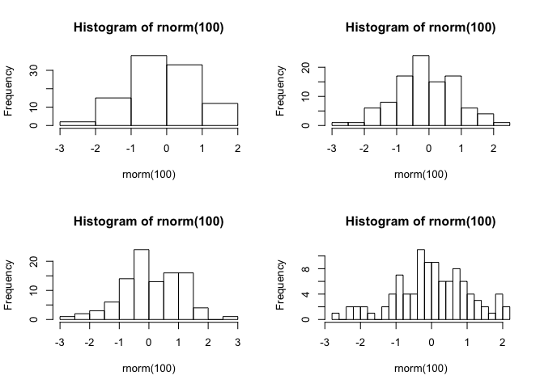
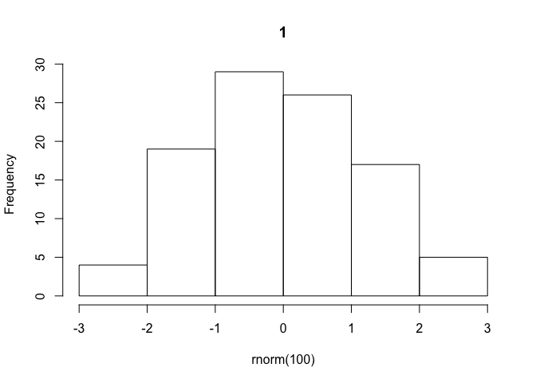
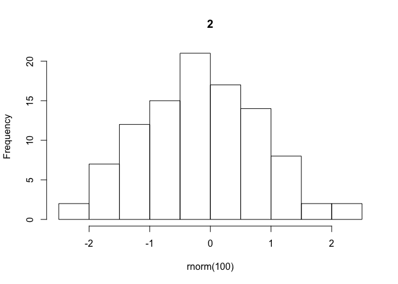
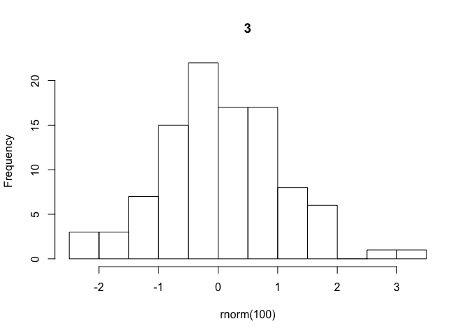
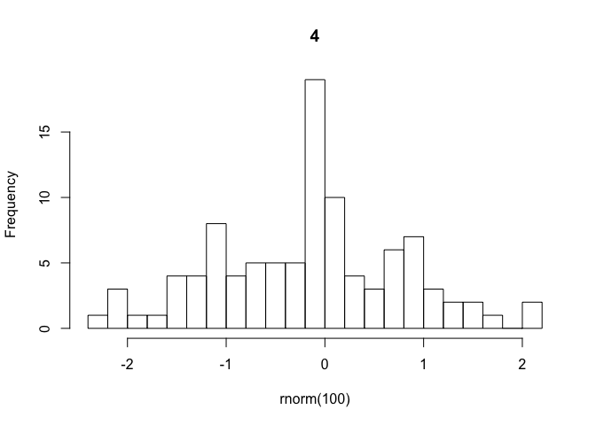
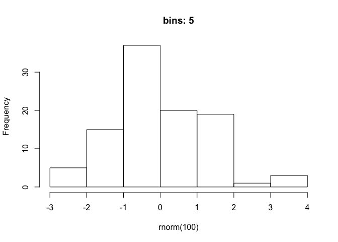
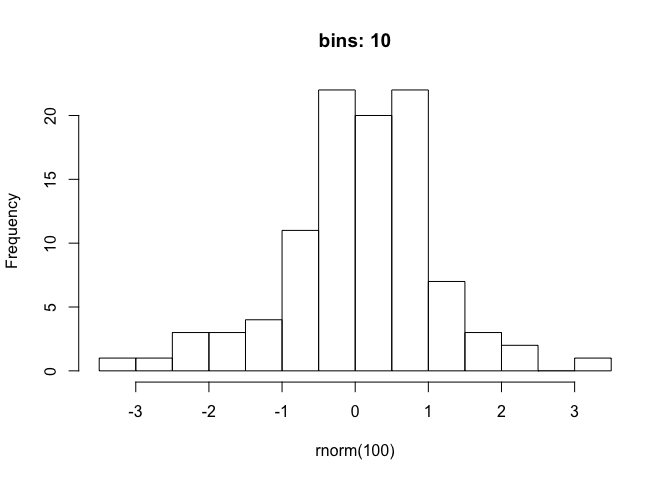
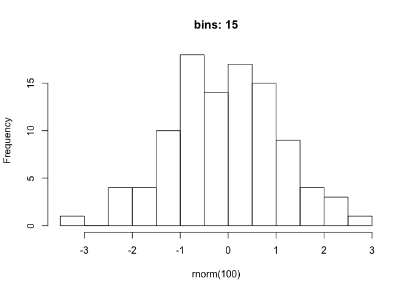
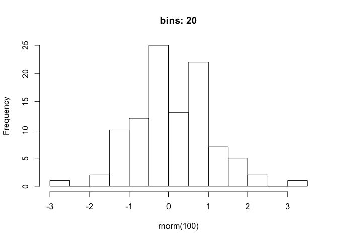

Advanced R 09-functionals
================
ian handel
2019-04-17

``` r
# ignore errors when knitting
knitr::opts_chunk$set(error = TRUE)

library(tidyverse)
```

    ## ── Attaching packages ──────────────────────────────────────────── tidyverse 1.2.1 ──

    ## ✔ ggplot2 3.1.1       ✔ purrr   0.3.2  
    ## ✔ tibble  2.1.1       ✔ dplyr   0.8.0.1
    ## ✔ tidyr   0.8.3       ✔ stringr 1.4.0  
    ## ✔ readr   1.3.1       ✔ forcats 0.4.0

    ## ── Conflicts ─────────────────────────────────────────────── tidyverse_conflicts() ──
    ## ✖ dplyr::filter() masks stats::filter()
    ## ✖ dplyr::lag()    masks stats::lag()

``` r
# for purrr, dplyr, ggplot2

library(repurrrsive)
# for data
```

================================================== functionals

``` r
f <- function(f){
  f(c(1, 5, 10, 100))
}

f(mean)
```

    ## [1] 29

``` r
f(sd)
```

    ## [1] 47.47631

``` r
f(max)
```

    ## [1] 100

``` r
f(function(X) X + 1000)
```

    ## [1] 1001 1005 1010 1100

==================================================
==================================================

The basic idea

``` r
x <- c(1, 2, 3)

map(x, sqrt)
```

    ## [[1]]
    ## [1] 1
    ## 
    ## [[2]]
    ## [1] 1.414214
    ## 
    ## [[3]]
    ## [1] 1.732051

================================================== Controlling the output

``` r
map_dbl(x, sqrt)
```

    ## [1] 1.000000 1.414214 1.732051

``` r
map_chr(x, sqrt)
```

    ## [1] "1.000000" "1.414214" "1.732051"

================================================== These functions expect a scalar output from .f

``` r
pair <- function(y) c(y, y)

pair(2.3)
```

    ## [1] 2.3 2.3

``` r
map_dbl(x, pair)
```

    ## Result 1 must be a single double, not a double vector of length 2

``` r
map(x, pair)
```

    ## [[1]]
    ## [1] 1 1
    ## 
    ## [[2]]
    ## [1] 2 2
    ## 
    ## [[3]]
    ## [1] 3 3

================================================== and the right type of output

``` r
as.character(3.14)
```

    ## [1] "3.14"

``` r
map_dbl(x, as.character)
```

    ## Error: Can't coerce element 1 from a character to a double

``` r
map_chr(x, as.character)
```

    ## [1] "1" "2" "3"

================================================== anonymous functions

``` r
mtcars
```

    ##                      mpg cyl  disp  hp drat    wt  qsec vs am gear carb
    ## Mazda RX4           21.0   6 160.0 110 3.90 2.620 16.46  0  1    4    4
    ## Mazda RX4 Wag       21.0   6 160.0 110 3.90 2.875 17.02  0  1    4    4
    ## Datsun 710          22.8   4 108.0  93 3.85 2.320 18.61  1  1    4    1
    ## Hornet 4 Drive      21.4   6 258.0 110 3.08 3.215 19.44  1  0    3    1
    ## Hornet Sportabout   18.7   8 360.0 175 3.15 3.440 17.02  0  0    3    2
    ## Valiant             18.1   6 225.0 105 2.76 3.460 20.22  1  0    3    1
    ## Duster 360          14.3   8 360.0 245 3.21 3.570 15.84  0  0    3    4
    ## Merc 240D           24.4   4 146.7  62 3.69 3.190 20.00  1  0    4    2
    ## Merc 230            22.8   4 140.8  95 3.92 3.150 22.90  1  0    4    2
    ## Merc 280            19.2   6 167.6 123 3.92 3.440 18.30  1  0    4    4
    ## Merc 280C           17.8   6 167.6 123 3.92 3.440 18.90  1  0    4    4
    ## Merc 450SE          16.4   8 275.8 180 3.07 4.070 17.40  0  0    3    3
    ## Merc 450SL          17.3   8 275.8 180 3.07 3.730 17.60  0  0    3    3
    ## Merc 450SLC         15.2   8 275.8 180 3.07 3.780 18.00  0  0    3    3
    ## Cadillac Fleetwood  10.4   8 472.0 205 2.93 5.250 17.98  0  0    3    4
    ## Lincoln Continental 10.4   8 460.0 215 3.00 5.424 17.82  0  0    3    4
    ## Chrysler Imperial   14.7   8 440.0 230 3.23 5.345 17.42  0  0    3    4
    ## Fiat 128            32.4   4  78.7  66 4.08 2.200 19.47  1  1    4    1
    ## Honda Civic         30.4   4  75.7  52 4.93 1.615 18.52  1  1    4    2
    ## Toyota Corolla      33.9   4  71.1  65 4.22 1.835 19.90  1  1    4    1
    ## Toyota Corona       21.5   4 120.1  97 3.70 2.465 20.01  1  0    3    1
    ## Dodge Challenger    15.5   8 318.0 150 2.76 3.520 16.87  0  0    3    2
    ## AMC Javelin         15.2   8 304.0 150 3.15 3.435 17.30  0  0    3    2
    ## Camaro Z28          13.3   8 350.0 245 3.73 3.840 15.41  0  0    3    4
    ## Pontiac Firebird    19.2   8 400.0 175 3.08 3.845 17.05  0  0    3    2
    ## Fiat X1-9           27.3   4  79.0  66 4.08 1.935 18.90  1  1    4    1
    ## Porsche 914-2       26.0   4 120.3  91 4.43 2.140 16.70  0  1    5    2
    ## Lotus Europa        30.4   4  95.1 113 3.77 1.513 16.90  1  1    5    2
    ## Ford Pantera L      15.8   8 351.0 264 4.22 3.170 14.50  0  1    5    4
    ## Ferrari Dino        19.7   6 145.0 175 3.62 2.770 15.50  0  1    5    6
    ## Maserati Bora       15.0   8 301.0 335 3.54 3.570 14.60  0  1    5    8
    ## Volvo 142E          21.4   4 121.0 109 4.11 2.780 18.60  1  1    4    2

named function

``` r
unique_length <- function(y) length(unique(y))

z <- c(1, 2, 3, 1, 2)

unique_length(z)
```

    ## [1] 3

``` r
map_int(mtcars, unique_length)
```

    ##  mpg  cyl disp   hp drat   wt qsec   vs   am gear carb 
    ##   25    3   27   22   22   29   30    2    2    3    6

using anaonymous functions

``` r
map_int(mtcars, function(X) length(unique(X)))
```

    ##  mpg  cyl disp   hp drat   wt qsec   vs   am gear carb 
    ##   25    3   27   22   22   29   30    2    2    3    6

``` r
map_int(mtcars, ~length(unique(.x)))
```

    ##  mpg  cyl disp   hp drat   wt qsec   vs   am gear carb 
    ##   25    3   27   22   22   29   30    2    2    3    6

================================================== Extracting stuff

``` r
x <- list(
  list(-1, x = 1, y = c(2), z = "a"),
  list(-2, x = 4, y = c(5, 6), z = "b"),
  list(-3, x = 8, y = c(9, 10, 11))
)

x
```

    ## [[1]]
    ## [[1]][[1]]
    ## [1] -1
    ## 
    ## [[1]]$x
    ## [1] 1
    ## 
    ## [[1]]$y
    ## [1] 2
    ## 
    ## [[1]]$z
    ## [1] "a"
    ## 
    ## 
    ## [[2]]
    ## [[2]][[1]]
    ## [1] -2
    ## 
    ## [[2]]$x
    ## [1] 4
    ## 
    ## [[2]]$y
    ## [1] 5 6
    ## 
    ## [[2]]$z
    ## [1] "b"
    ## 
    ## 
    ## [[3]]
    ## [[3]][[1]]
    ## [1] -3
    ## 
    ## [[3]]$x
    ## [1] 8
    ## 
    ## [[3]]$y
    ## [1]  9 10 11

``` r
map(x, "y")
```

    ## [[1]]
    ## [1] 2
    ## 
    ## [[2]]
    ## [1] 5 6
    ## 
    ## [[3]]
    ## [1]  9 10 11

``` r
map(x, 3)
```

    ## [[1]]
    ## [1] 2
    ## 
    ## [[2]]
    ## [1] 5 6
    ## 
    ## [[3]]
    ## [1]  9 10 11

``` r
map(x, list("y", 1))
```

    ## [[1]]
    ## [1] 2
    ## 
    ## [[2]]
    ## [1] 5
    ## 
    ## [[3]]
    ## [1] 9

NOT

``` r
map(x, "y", 1)
```

    ## [[1]]
    ## [1] 2
    ## 
    ## [[2]]
    ## [1] 5 6
    ## 
    ## [[3]]
    ## [1]  9 10 11

================================================== Passing other argument to .f

``` r
x <- list(a = c(1.1111, 2.2222), b = c(4.44444, 5.5555))

x
```

    ## $a
    ## [1] 1.1111 2.2222
    ## 
    ## $b
    ## [1] 4.44444 5.55550

``` r
map(x, round)
```

    ## $a
    ## [1] 1 2
    ## 
    ## $b
    ## [1] 4 6

``` r
map(x, round, 2)
```

    ## $a
    ## [1] 1.11 2.22
    ## 
    ## $b
    ## [1] 4.44 5.56

``` r
?round

map(x, round, digits = 1)
```

    ## $a
    ## [1] 1.1 2.2
    ## 
    ## $b
    ## [1] 4.4 5.6

================================================== varying another argument - i.e. not the first

``` r
roundiness <- c(0, 1, 2, 3)

map_dbl(roundiness, round, pi)
```

    ## [1] 0 1 2 3

``` r
map_dbl(roundiness, ~ round(x = pi, digits = .x))
```

    ## [1] 3.000 3.100 3.140 3.142

================================================== purr style - examples ================================================== multiple inputs

``` r
nums <- c(1.234, 4.324, 7.223)
roundiness <- c(1, 2, 3)

map2_dbl(nums, roundiness, round)
```

    ## [1] 1.200 4.320 7.223

``` r
map2_dbl(nums, roundiness, ~round(.x, digits = .y))
```

    ## [1] 1.200 4.320 7.223

================================================== walk

``` r
bins <- c(5, 10, 15, 20)

par(mfrow = c(2,2))
walk(bins, ~hist(rnorm(100), breaks  = .x))
```



================================================== iterating over values

``` r
iwalk(bins, ~hist(rnorm(100), breaks  = .x, main = .y))
```



``` r
bins
```

    ## [1]  5 10 15 20

``` r
bins <- c(5, 10, 15, 20) %>% set_names()

bins
```

    ##  5 10 15 20 
    ##  5 10 15 20

``` r
iwalk(bins, ~hist(rnorm(100), breaks  = .x, main = paste0("bins: ", .y)))
```



================================================== Lots of inputs

``` r
car_coolness <- function(hwy, cty, displ){
  hwy + cty + displ * 100
}

car_coolness(hwy = 30, cty = 40, displ = 2)
```

    ## [1] 270

``` r
pmap_dbl(list(hwy = c(30, 50),
          cty = c(25, 67),
          displ = c(1, 2)),
     car_coolness)
```

    ## [1] 155 317

``` r
pmap_dbl(mpg, car_coolness)
```

    ## Error in .f(manufacturer = .l[[1L]][[i]], model = .l[[2L]][[i]], displ = .l[[3L]][[i]], : unused arguments (manufacturer = .l[[1]][[i]], model = .l[[2]][[i]], year = .l[[4]][[i]], cyl = .l[[5]][[i]], trans = .l[[6]][[i]], drv = .l[[7]][[i]], fl = .l[[10]][[i]], class = .l[[11]][[i]])

``` r
# add dots!!!
```

================================================== safely, possibly, quietly

``` r
dat <- list(1, 4, "A", 7)

map_dbl(dat, log)
```

    ## Error in .Primitive("log")(x, base): non-numeric argument to mathematical function

``` r
poss_log <- possibly(log, otherwise = NA)

class(poss_log)
```

    ## [1] "function"

``` r
map_dbl(dat, poss_log)
```

    ## [1] 0.000000 1.386294       NA 1.945910

================================================== reduce and accumulate

``` r
x <- c(1, 7, 4, 2)

reduce(x, `+`)
```

    ## [1] 14

``` r
reduce(x, `*`)
```

    ## [1] 56

``` r
accumulate(x, `+`)
```

    ## [1]  1  8 12 14

``` r
cumsum(x)
```

    ## [1]  1  8 12 14

``` r
accumulate(x, `*`)
```

    ## [1]  1  7 28 56

``` r
cumprod(x)
```

    ## [1]  1  7 28 56

================================================== predicate frunctions

``` r
df <- tibble(a = c(1, 2, NA, 4),
             b = c("A", "B", "C", "N"),
             c = c(7, 2, NA, 2))

some(df, is.character)
```

    ## [1] TRUE

``` r
detect(df, is.character)
```

    ## [1] "A" "B" "C" "N"

``` r
detect_index(df, is.character)
```

    ## [1] 2

``` r
keep(df, is.character)
```

    ## # A tibble: 4 x 1
    ##   b    
    ##   <chr>
    ## 1 A    
    ## 2 B    
    ## 3 C    
    ## 4 N

``` r
# using them...

mpg
```

    ## # A tibble: 234 x 11
    ##    manufacturer model displ  year   cyl trans drv     cty   hwy fl    class
    ##    <chr>        <chr> <dbl> <int> <int> <chr> <chr> <int> <int> <chr> <chr>
    ##  1 audi         a4      1.8  1999     4 auto… f        18    29 p     comp…
    ##  2 audi         a4      1.8  1999     4 manu… f        21    29 p     comp…
    ##  3 audi         a4      2    2008     4 manu… f        20    31 p     comp…
    ##  4 audi         a4      2    2008     4 auto… f        21    30 p     comp…
    ##  5 audi         a4      2.8  1999     6 auto… f        16    26 p     comp…
    ##  6 audi         a4      2.8  1999     6 manu… f        18    26 p     comp…
    ##  7 audi         a4      3.1  2008     6 auto… f        18    27 p     comp…
    ##  8 audi         a4 q…   1.8  1999     4 manu… 4        18    26 p     comp…
    ##  9 audi         a4 q…   1.8  1999     4 auto… 4        16    25 p     comp…
    ## 10 audi         a4 q…   2    2008     4 manu… 4        20    28 p     comp…
    ## # … with 224 more rows

``` r
cor(mpg)
```

    ## Error in cor(mpg): 'x' must be numeric

``` r
keep(mpg, is_bare_numeric) %>% cor()
```

    ##            displ         year        cyl         cty          hwy
    ## displ  1.0000000  0.147842816  0.9302271 -0.79852397 -0.766020021
    ## year   0.1478428  1.000000000  0.1222453 -0.03723229  0.002157643
    ## cyl    0.9302271  0.122245347  1.0000000 -0.80577141 -0.761912354
    ## cty   -0.7985240 -0.037232291 -0.8057714  1.00000000  0.955915914
    ## hwy   -0.7660200  0.002157643 -0.7619124  0.95591591  1.000000000

``` r
mpg
```

    ## # A tibble: 234 x 11
    ##    manufacturer model displ  year   cyl trans drv     cty   hwy fl    class
    ##    <chr>        <chr> <dbl> <int> <int> <chr> <chr> <int> <int> <chr> <chr>
    ##  1 audi         a4      1.8  1999     4 auto… f        18    29 p     comp…
    ##  2 audi         a4      1.8  1999     4 manu… f        21    29 p     comp…
    ##  3 audi         a4      2    2008     4 manu… f        20    31 p     comp…
    ##  4 audi         a4      2    2008     4 auto… f        21    30 p     comp…
    ##  5 audi         a4      2.8  1999     6 auto… f        16    26 p     comp…
    ##  6 audi         a4      2.8  1999     6 manu… f        18    26 p     comp…
    ##  7 audi         a4      3.1  2008     6 auto… f        18    27 p     comp…
    ##  8 audi         a4 q…   1.8  1999     4 manu… 4        18    26 p     comp…
    ##  9 audi         a4 q…   1.8  1999     4 auto… 4        16    25 p     comp…
    ## 10 audi         a4 q…   2    2008     4 manu… 4        20    28 p     comp…
    ## # … with 224 more rows

``` r
a <- mpg %>%
  modify_if(is_bare_numeric, round)

# b <- mpg %>%
#   mutate_if(is_bare_numeric, round)
# 
# all_equal(a, b)


# exercise - SPAN
# Implement the span() function from Haskell: given a list x and a predicate function f, span(x, f) returns the location of the longest sequential run of elements where the predicate is true. (Hint: you might find rle() helpful.)

span <- function(x, f){
  r <- rle(unname(map_lgl(x, f)))
  ii <- which.max(r$lengths * r$value)
  sum(r$lengths[1:(ii-1)] + 1)
  }

r <- c(1,3,2,4,5,4,3,3,5,1,2,1,1,1,1)


span(r, function(x) x>2)
```

    ## [1] 6

``` r
span(iris, is.numeric)
```

    ## [1] 5

``` r
span(iris, is.factor)
```

    ## [1] 5
